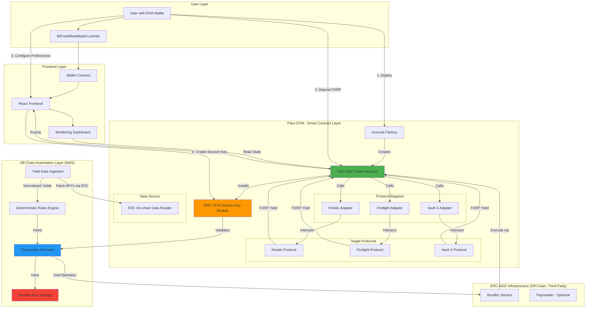
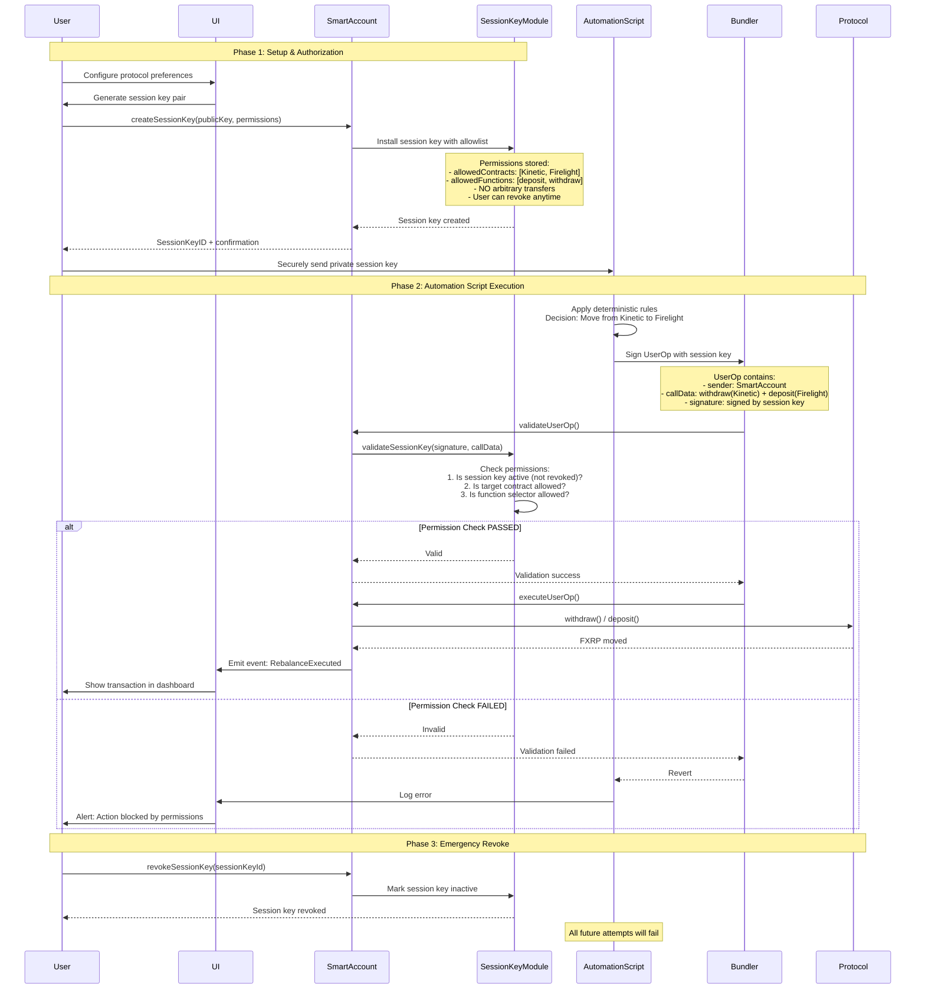
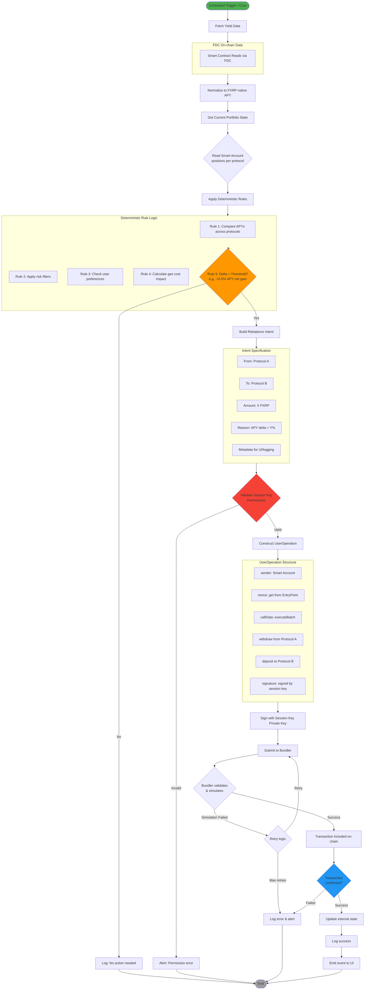
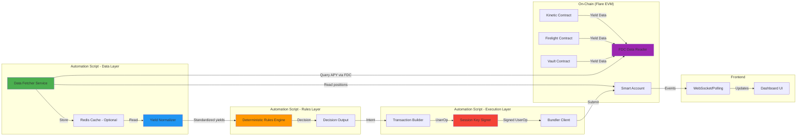

# Kimera DeFAI Yield Automation - Architecture Review & Refinement

**Document Version:** 1.0-deterministic
**Date:** 2025-12-18
**Status:** Technical Review with Diagrams

---

## 1. High-Level System Architecture



### Why Transaction Executor & Session Key Storage are Off-Chain

The **Transaction Executor** and **Session Key Storage** reside in the Off-Chain Automation Layer (AWS) rather than on Flare EVM for fundamental blockchain architecture reasons:

**Session Key Storage:**
- Stores the **private key** of the session key pair
- Private keys **cannot** be stored on-chain — blockchain data is public and anyone could read it
- Only the **public key/address** and its permissions (allowed contracts, functions) are stored on-chain in the Session Key Module
- The private key must remain secret off-chain to securely sign transactions

**Transaction Executor:**
- Smart contracts are **passive** — they cannot initiate transactions on their own
- An off-chain component is required to:
  1. Run the deterministic decision logic (when to rebalance)
  2. Sign UserOperations with the private session key
  3. Submit signed UserOperations to the bundler
- The on-chain Session Key Module then **validates** the signature and permissions before execution

**Execution Flow:**
```
Off-chain (AWS)                      On-chain (Flare EVM)
─────────────────                    ────────────────────
Script decides to rebalance
(based on deterministic rules)
         ↓
Sign with private session key
         ↓
Submit to Bundler  ────────────────→  Session Key Module validates
                                              ↓
                                      Smart Account executes
                                              ↓
                                      Protocol interaction
```

---

## 2. Session Key Security Model & Permission Flow



### Permission Matrix

| Actor | Can Deploy Account | Can Deposit | Can Withdraw to User | Can Withdraw to Script | Can Transfer to Arbitrary | Can Revoke Session Key |
|-------|-------------------|-------------|---------------------|----------------------|--------------------------|------------------------|
| **User (Owner EOA)** | Yes | Yes | Yes | No | Yes (Full Control) | Yes |
| **Automation Script (Session Key)** | No | Yes (to whitelisted protocols) | No | No | No | No |
| **Smart Account** | N/A | Yes (executes) | Yes (executes) | No | Yes (if owner approves) | N/A |

### Critical Security Constraints

1. **Session Key CANNOT:**
   - Transfer FXRP to arbitrary addresses
   - Call functions outside allowlist
   - Interact with contracts outside allowlist
   - Modify account ownership
   - Create/revoke other session keys

2. **Session Key CAN ONLY:**
   - Call `deposit()` on whitelisted protocols
   - Call `withdraw()` to the Smart Account itself
   - Call `claimRewards()` if enabled

3. **User Always Retains:**
   - Full ownership via EOA
   - Emergency revoke capability
   - Direct withdrawal rights
   - Account upgrade rights

---

## 3. Deterministic Rules Engine - Decision & Execution Flow



**Note: APY Normalization**

The "Normalize to FXRP-native APY" step converts each protocol's yield into a standardized, comparable format: how much actual FXRP is earned per 100 FXRP deposited over one year. This enables comparison across protocols that may express returns differently (secondary reward tokens, hidden fees, etc.).

### Deterministic Rules Engine - Python Implementation

```python
"""
Kimera Yield Optimizer - Deterministic Rules Engine
No AI/ML components - pure rule-based decision making
"""

from dataclasses import dataclass
from enum import Enum
from typing import Dict, List, Optional
import logging

logger = logging.getLogger(__name__)


class RiskTolerance(Enum):
    CONSERVATIVE = "conservative"
    MODERATE = "moderate"
    AGGRESSIVE = "aggressive"


@dataclass
class ProtocolYield:
    protocol_name: str
    fxrp_apy: float  # Annual Percentage Yield
    tvl: float  # Total Value Locked
    utilization_rate: float
    last_updated: int  # timestamp


@dataclass
class UserPreferences:
    smart_account_address: str
    allowed_protocols: List[str]
    risk_tolerance: RiskTolerance
    rebalance_threshold: float  # minimum APY delta %
    min_position_size: float  # minimum FXRP to consider rebalancing
    session_key_id: str
    is_active: bool


@dataclass
class RebalanceIntent:
    intent_id: str
    from_protocol: str
    to_protocol: str
    amount: float
    gross_apy_delta: float
    estimated_gas_cost: float
    net_apy_delta: float
    justification: str
    status: str  # "pending" | "executed" | "failed" | "skipped"


class DeterministicRulesEngine:
    """
    Pure rule-based yield optimization engine.
    All decisions are deterministic and reproducible.
    """

    # Configuration constants
    DEFAULT_REBALANCE_THRESHOLD = 0.5  # 0.5% minimum net APY gain
    MIN_TVL_THRESHOLD = 100_000  # $100k minimum TVL for safety
    MAX_UTILIZATION_RATE = 0.95  # 95% max utilization
    CONSERVATIVE_MAX_APY = 15.0  # Suspicious if APY > 15%
    MODERATE_MAX_APY = 30.0
    AGGRESSIVE_MAX_APY = 100.0

    def __init__(self, gas_price_gwei: float = 25.0):
        self.gas_price_gwei = gas_price_gwei
        self.estimated_gas_per_rebalance = 300_000  # gas units

    def optimize_yield(
        self,
        current_positions: Dict[str, float],
        protocol_yields: Dict[str, ProtocolYield],
        user_preferences: UserPreferences,
        fxrp_price_usd: float = 0.5
    ) -> Optional[RebalanceIntent]:
        """
        Main entry point for yield optimization.
        Returns a RebalanceIntent if action is needed, None otherwise.
        """

        # Rule 0: Check if automation is active
        if not user_preferences.is_active:
            logger.info("Automation is disabled for this user")
            return None

        # Rule 1: Filter protocols by user preferences
        allowed_yields = self._filter_by_allowed_protocols(
            protocol_yields, user_preferences.allowed_protocols
        )

        if not allowed_yields:
            logger.warning("No allowed protocols with yield data")
            return None

        # Rule 2: Apply risk filters based on user tolerance
        safe_yields = self._apply_risk_filters(
            allowed_yields, user_preferences.risk_tolerance
        )

        if not safe_yields:
            logger.warning("No protocols passed risk filters")
            return None

        # Rule 3: Find the best opportunity
        best_protocol, best_apy = self._find_best_yield(safe_yields)

        # Rule 4: Calculate gas cost impact
        gas_cost_fxrp = self._calculate_gas_cost_fxrp(fxrp_price_usd)

        # Rule 5: Evaluate each current position for rebalancing
        for current_protocol, amount in current_positions.items():
            if amount < user_preferences.min_position_size:
                continue

            if current_protocol not in allowed_yields:
                continue

            current_apy = allowed_yields[current_protocol].fxrp_apy

            # Calculate deltas
            gross_delta = best_apy - current_apy

            # Annualized gas cost as percentage of position
            gas_cost_annual_pct = (gas_cost_fxrp / amount) * 100

            net_delta = gross_delta - gas_cost_annual_pct

            # Rule 6: Check threshold
            threshold = user_preferences.rebalance_threshold or self.DEFAULT_REBALANCE_THRESHOLD

            if net_delta > threshold and best_protocol != current_protocol:
                justification = (
                    f"Moving {amount:.2f} FXRP from {current_protocol} "
                    f"({current_apy:.2f}% APY) to {best_protocol} ({best_apy:.2f}% APY). "
                    f"Gross improvement: {gross_delta:.2f}%, "
                    f"Gas cost impact: {gas_cost_annual_pct:.2f}%, "
                    f"Net improvement: {net_delta:.2f}%"
                )

                logger.info(f"Rebalance decision: {justification}")

                return RebalanceIntent(
                    intent_id=f"intent_{current_protocol}_{best_protocol}_{int(amount)}",
                    from_protocol=current_protocol,
                    to_protocol=best_protocol,
                    amount=amount,
                    gross_apy_delta=gross_delta,
                    estimated_gas_cost=gas_cost_fxrp,
                    net_apy_delta=net_delta,
                    justification=justification,
                    status="pending"
                )

        logger.info("No rebalancing needed - all positions optimal or below threshold")
        return None

    def _filter_by_allowed_protocols(
        self,
        yields: Dict[str, ProtocolYield],
        allowed: List[str]
    ) -> Dict[str, ProtocolYield]:
        """Rule 1: Filter by user's allowed protocol list"""
        return {
            name: data for name, data in yields.items()
            if name in allowed
        }

    def _apply_risk_filters(
        self,
        yields: Dict[str, ProtocolYield],
        risk_tolerance: RiskTolerance
    ) -> Dict[str, ProtocolYield]:
        """Rule 2: Apply risk-based filters"""

        # Determine max APY based on risk tolerance
        max_apy_limits = {
            RiskTolerance.CONSERVATIVE: self.CONSERVATIVE_MAX_APY,
            RiskTolerance.MODERATE: self.MODERATE_MAX_APY,
            RiskTolerance.AGGRESSIVE: self.AGGRESSIVE_MAX_APY
        }
        max_apy = max_apy_limits[risk_tolerance]

        filtered = {}
        for name, data in yields.items():
            # Check TVL minimum
            if data.tvl < self.MIN_TVL_THRESHOLD:
                logger.debug(f"Skipping {name}: TVL {data.tvl} below minimum")
                continue

            # Check utilization rate
            if data.utilization_rate > self.MAX_UTILIZATION_RATE:
                logger.debug(f"Skipping {name}: utilization {data.utilization_rate} too high")
                continue

            # Check suspicious APY
            if data.fxrp_apy > max_apy:
                logger.warning(f"Skipping {name}: APY {data.fxrp_apy}% exceeds risk threshold")
                continue

            # Check for negative APY (shouldn't happen, but safety check)
            if data.fxrp_apy < 0:
                logger.warning(f"Skipping {name}: negative APY detected")
                continue

            filtered[name] = data

        return filtered

    def _find_best_yield(
        self,
        yields: Dict[str, ProtocolYield]
    ) -> tuple[str, float]:
        """Rule 3: Find the protocol with highest APY"""
        best_protocol = max(yields, key=lambda x: yields[x].fxrp_apy)
        best_apy = yields[best_protocol].fxrp_apy
        return best_protocol, best_apy

    def _calculate_gas_cost_fxrp(self, fxrp_price_usd: float) -> float:
        """Rule 4: Calculate gas cost in FXRP terms"""
        # Gas cost in native token (FLR)
        gas_cost_flr = (self.estimated_gas_per_rebalance * self.gas_price_gwei) / 1e9

        # Assuming FLR price ~ $0.02 for estimation
        flr_price_usd = 0.02
        gas_cost_usd = gas_cost_flr * flr_price_usd

        # Convert to FXRP
        gas_cost_fxrp = gas_cost_usd / fxrp_price_usd

        return gas_cost_fxrp
```

### Decision Rules Summary

```
KIMERA DETERMINISTIC REBALANCING RULES
======================================

Rule 1: PROTOCOL ALLOWLIST
- Only consider protocols explicitly allowed by user
- User configures this via UI during setup

Rule 2: RISK FILTERS
- TVL must be > $100,000 (avoid low-liquidity protocols)
- Utilization rate must be < 95% (ensure liquidity)
- APY must be within risk tolerance bounds:
  - Conservative: max 15% APY
  - Moderate: max 30% APY
  - Aggressive: max 100% APY
- Reject negative or zero APY

Rule 3: BEST YIELD SELECTION
- Select protocol with highest APY that passes all filters
- Simple max() operation - no ML or predictions

Rule 4: GAS COST CALCULATION
- Estimate gas cost per rebalance (~300k gas units)
- Convert to FXRP terms using current prices
- Calculate annualized impact on position

Rule 5: NET BENEFIT THRESHOLD
- Gross APY delta = new_apy - current_apy
- Net APY delta = gross_delta - gas_cost_impact
- Only rebalance if net_delta > threshold (default 0.5%)

Rule 6: POSITION MINIMUM
- Skip positions below minimum size (configurable)
- Prevents gas-negative rebalancing for small amounts

EXECUTION RULES:
- Run on schedule (default: every 4 hours)
- Maximum 1 rebalance per cycle per user
- Log all decisions with full justification
- Alert user on errors or blocked actions
```

---

## 4. Data Flow Diagram



---

## 5. Technical Refinements & Recommendations

### 5.1 Architecture Strengths

**Deterministic & Auditable**
- All decisions follow explicit rules
- No black-box AI/ML components
- Every rebalance decision can be explained and reproduced
- Easy to debug and verify behavior

**Well-Defined Scope**
- Clear PoC boundaries prevent feature creep
- Single-asset (FXRP) reduces complexity significantly
- Explicit non-goals prevent misaligned expectations

**Security-First Approach**
- Session keys with explicit allowlists
- No arbitrary transfer permissions
- User maintains full ownership

**Pragmatic Centralization**
- AWS-hosted script acceptable for PoC
- Allows rapid iteration vs. full decentralization
- Clear path to decentralization in Phase 2+

### 5.2 Critical Gaps & Additions Needed

#### Critical: ERC-4337 Infrastructure Validation

**Problem:** Etherspot claims Flare support, but bundler/paymaster availability is unconfirmed.

**Recommendation:**
```
BEFORE any development:
1. Deploy a test Smart Account on Coston2 using Etherspot SDK
2. Attempt to submit a UserOperation via bundler
3. Validate gas sponsorship (if using paymaster)
4. Document actual gas costs vs. expectations

IF bundler infrastructure is immature:
- Fallback option: Use a meta-transaction relay instead of ERC-4337
- Build custom bundler (adds $8k-12k)
- Use direct EOA execution for PoC (defeats purpose of session keys)
```

---

#### Session Key Lifecycle

**Decision:** Non-expiring session keys for simplicity.

```
Policy:
- Session keys do NOT expire by default
- User can revoke at any time via UI (immediate effect)
- Security relies on contract + function allowlists, not time bounds

Rationale:
- Simpler UX: set once and forget
- No risk of script stopping unexpectedly due to expiry
- User retains full control via manual revocation
- Core security model (allowlists) is unchanged

Future consideration (Phase 2+):
- Optional expiry can be added as user preference
- Auto-rotation could be implemented if needed
```

---

#### Enhancement: Transaction Failure Recovery

```
Scenarios & Handling:

1. Insufficient gas:
   - Pre-flight simulation detects
   - Alert user to top up Smart Account
   - Retry after 10 minutes

2. Slippage / price change:
   - Protocol deposit fails due to capacity change
   - Log error, skip rebalance
   - Retry next cycle

3. Bundler unavailable:
   - Exponential backoff (1min, 5min, 15min)
   - After 3 failures: disable auto-execution
   - Alert user via UI

4. Session key revoked mid-execution:
   - Graceful failure
   - Do not retry (permission issue)
   - Alert user

Monitoring:
- All failures logged to CloudWatch
- Daily digest email if failures > threshold
```

---

#### Enhancement: Net Yield Calculation (After Gas)

```
Decision logic must include:
1. Gross APY delta: new_apy - current_apy
2. Estimated gas cost: ~$X per rebalance
3. Net APY improvement: gross_delta - (gas_cost / position_size)

Threshold: Only rebalance if net improvement > 0.5% APY

Example:
- Position: 10,000 FXRP
- Current APY: 5%
- New APY: 5.3%
- Gross delta: 0.3%
- Gas cost: $5 (~30 FXRP annual equivalent = 0.3%)
- Net delta: 0.3% - 0.3% = 0% → DO NOT REBALANCE

This prevents gas-negative rebalancing for small positions.
```

---

#### Nice-to-Have: Circuit Breaker

```
Trigger Conditions:
- Transaction failure rate > 50% over 1 hour
- Detected price oracle anomaly (APY > 1000%)
- Protocol paused/exploited (detected via event monitoring)
- User balance decreased > 10% in single transaction (potential exploit)

Actions:
- Immediately disable script execution
- Revoke session key automatically
- Alert user + team via email/Slack
- Require manual re-enable via UI

Implementation:
- Smart contract: pausable module
- Off-chain: kill switch in AWS

Cost: $2k-3k (highly recommended for PoC)
```

---

### 5.3 Data Model Specification

**User Preferences (Frontend → DB → Script)**
```typescript
interface UserPreferences {
  smartAccountAddress: string;
  allowedProtocols: string[]; // ["Kinetic", "Firelight"]
  riskTolerance: "conservative" | "moderate" | "aggressive";
  rebalanceThreshold: number; // minimum APY delta %
  sessionKeyId: string;
  isActive: boolean;  // User can revoke anytime
}
```

**Yield Data (Script Internal)**
```typescript
interface ProtocolYield {
  protocolName: string;
  fxrpAPY: number; // normalized to FXRP terms
  tvl: number;
  utilizationRate: number;
  lastUpdated: number; // timestamp
  dataSource: "fdc"; // FDC on-chain data reader
}
```

**Rebalance Intent (Script Output)**
```typescript
interface RebalanceIntent {
  intentId: string;
  timestamp: number;
  fromProtocol: string;
  toProtocol: string;
  amount: string; // Wei format
  grossApyDelta: number;
  estimatedGasCost: string;
  netApyDelta: number;
  justification: string; // human-readable, deterministic
  status: "pending" | "executed" | "failed" | "skipped";
}
```

---

### 5.4 Testing Requirements

```
E1. Unit Tests (Python Rules Engine)
- Test each rule in isolation
- Edge cases: zero APY, negative APY, equal APYs
- Threshold boundary testing
- Gas cost calculation accuracy

E2. Integration Tests
- Full flow: User deposits → Script rebalances → User withdraws
- Session key lifecycle: create → use → revoke → attempt use (should fail)
- Bundler interaction tests
- Multi-protocol rebalancing

E3. Testnet Validation (Coston2)
- Deploy all contracts
- Execute 20+ rebalance cycles
- Simulate failures (insufficient gas, protocol paused)
- Validate dashboard data accuracy

E4. Security Review (Pre-Audit)
- Internal threat model document
- Permissions matrix validation
- Attack vector analysis:
  - Session key compromise scenarios
  - Malicious protocol adapter
  - Front-running rebalancing
  - Gas griefing

E5. User Acceptance Testing
- 3-5 external testers (non-technical users)
- Validate "one-click UX" claim
- Gather feedback on transparency/trust
```

---

### 5.5 Deployment & Operations

**Automation Script Deployment (AWS)**
```
Architecture:
- Lambda for scheduled execution (every 4 hours)
- EC2 for continuous monitoring (optional)
- Secrets Manager for session keys
- RDS/DynamoDB for state persistence
- CloudWatch for logging
```

**Monitoring & Alerting**
```
Metrics:
- Rebalance execution rate
- Transaction failure rate
- User sign-ups / active accounts
- Total value locked (TVL)
- Average APY improvement per user

Alerts:
- Transaction failures > 10% → Slack alert
- Session key revoked → Log and stop execution
- Circuit breaker triggered → Emergency alert
```

**Incident Response**
```
Scenarios:
- Protocol exploit detected
- Bundler outage
- Smart contract bug discovered
- Session key leak

Response:
- Pause script execution
- Revoke all session keys
- Notify users via UI banner
- Post-mortem after resolution
```

---

## 6. Risk Mitigation Summary

| Risk | Likelihood | Impact | Mitigation |
|------|------------|--------|------------|
| ERC-4337 bundler unavailable on Flare | Medium | High | Validate in Week 1, fallback to meta-tx relay |
| Session key compromise | Low | Critical | Allowlist restrictions, user revocation, circuit breaker |
| FXRP reward token complexity | Medium | Medium | Exclude auto-compound in Phase 1 |
| Gas-negative rebalancing | Medium | Low | Net yield calculation with gas cost |
| Protocol exploit during PoC | Low | High | Circuit breaker, pause mechanism |
| Scope creep (multi-asset, swaps) | High | Medium | Strict SoW, explicit deferred features |

---

## 7. Next Steps

1. **Validate ERC-4337 on Flare (Week 1)**
   - Deploy test Smart Account on Coston2
   - Submit test UserOperation
   - Document findings

2. **Finalize Technical Spec**
   - Incorporate refinements from this review
   - Get stakeholder sign-off

3. **Kickoff Development (Week 2)**
   - Smart contract development
   - Frontend scaffolding
   - AWS infrastructure setup

4. **Weekly Reviews**
   - Demo every Friday
   - Risk review every Monday

---

## Appendix A: Technology Stack Recommendation

### Off-Chain Automation Script
- **Language:** Python 3.11+
- **Framework:** FastAPI (for future API exposure)
- **Blockchain Library:** Web3.py
- **Scheduler:** AWS Lambda (cron) or APScheduler
- **Database:** PostgreSQL (RDS) for state, Redis for caching

### Frontend
- **Framework:** Next.js 14 (React)
- **Wallet Integration:** RainbowKit or Web3Modal
- **State Management:** Zustand (lighter than Redux)
- **UI Library:** Tailwind CSS + shadcn/ui

### Infrastructure
- **Hosting:** AWS (Lambda + EC2 + RDS)
- **Secrets:** AWS Secrets Manager
- **Monitoring:** CloudWatch + Sentry (error tracking)
- **CI/CD:** GitHub Actions

---

## Appendix B: Deterministic Rules vs AI Agent Comparison

| Aspect | Deterministic Rules (This Doc) | AI Agent (Original) |
|--------|-------------------------------|---------------------|
| **Predictability** | 100% - same inputs = same outputs | Variable - may change decisions |
| **Explainability** | Full - every decision has clear justification | Limited - "black box" reasoning |
| **Auditability** | Easy - rule set is explicit | Hard - requires ML model inspection |
| **Maintenance** | Simple - modify rules directly | Complex - requires retraining |
| **Adaptability** | Manual - requires code changes | Automatic - learns from data |
| **Edge Cases** | Must be explicitly coded | May handle some automatically |
| **User Trust** | High - behavior is transparent | Lower - "AI" can seem opaque |
| **Development Cost** | Lower - no ML infrastructure | Higher - needs ML pipeline |
| **Operational Cost** | Lower - no inference costs | Higher - model serving costs |

**Recommendation for PoC:** Deterministic rules provide better transparency, lower cost, and easier debugging. AI/ML can be explored in Phase 2+ once the core platform is validated.

---

**End of Architecture Review (Deterministic Version)**
