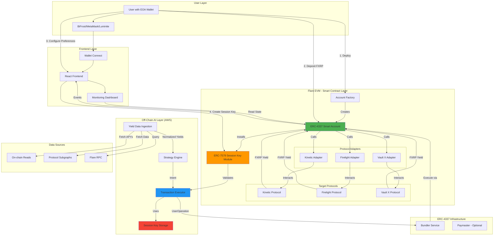
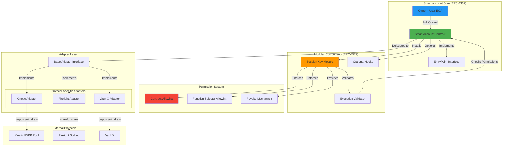
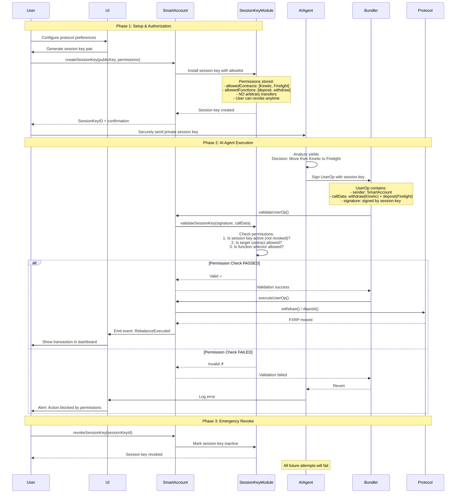
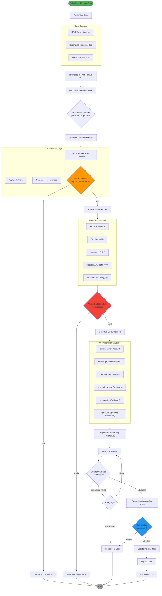
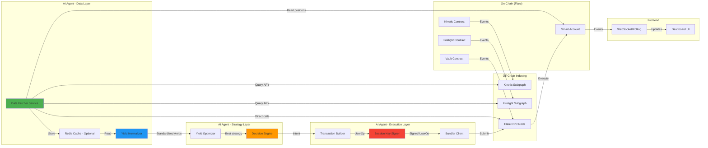

# Kimera DeFAI Yield Agent - Architecture Review & Refinement

**Document Version:** 1.0
**Date:** 2025-12-18
**Status:** Technical Review with Diagrams

---

## 1. High-Level System Architecture



---

## 2. Smart Contract Layer Architecture



### Key Contracts Specification

#### Smart Account Contract
```solidity
// Pseudo-interface for clarity
interface IKimeraSmartAccount {
    // ERC-4337 required
    function validateUserOp(UserOperation calldata userOp, bytes32 userOpHash, uint256 missingAccountFunds)
        external returns (uint256 validationData);

    // ERC-7579 module management
    function installModule(uint256 moduleTypeId, address module, bytes calldata initData) external;
    function uninstallModule(uint256 moduleTypeId, address module, bytes calldata deInitData) external;

    // Execution
    function execute(address dest, uint256 value, bytes calldata func) external;
    function executeBatch(address[] calldata dest, uint256[] calldata value, bytes[] calldata func) external;

    // Owner control
    function transferOwnership(address newOwner) external;
}
```

#### Session Key Module
```solidity
interface ISessionKeyModule {
    struct SessionKeyData {
        address sessionKey;
        address[] allowedContracts;
        bytes4[] allowedFunctions;
        bool isActive;  // User can revoke anytime
    }

    function createSessionKey(
        address sessionKey,
        address[] calldata allowedContracts,
        bytes4[] calldata allowedFunctions
    ) external returns (bytes32 sessionKeyId);

    function revokeSessionKey(bytes32 sessionKeyId) external;

    function validateSessionKeyExecution(
        bytes32 sessionKeyId,
        address target,
        bytes calldata data
    ) external view returns (bool);
}
```

#### Protocol Adapter Interface
```solidity
interface IProtocolAdapter {
    function deposit(uint256 amount) external returns (bool);
    function withdraw(uint256 amount) external returns (bool);
    function claimRewards() external returns (uint256);
    function getBalance(address account) external view returns (uint256);
    function getCurrentAPY() external view returns (uint256);
}
```

---

## 3. Session Key Security Model & Permission Flow



### Permission Matrix

| Actor | Can Deploy Account | Can Deposit | Can Withdraw to User | Can Withdraw to Agent | Can Transfer to Arbitrary | Can Revoke Session Key |
|-------|-------------------|-------------|---------------------|----------------------|--------------------------|------------------------|
| **User (Owner EOA)** | ✅ | ✅ | ✅ | ❌ | ✅ (Full Control) | ✅ |
| **AI Agent (Session Key)** | ❌ | ✅ (to whitelisted protocols) | ❌ | ❌ | ❌ | ❌ |
| **Smart Account** | N/A | ✅ (executes) | ✅ (executes) | ❌ | ✅ (if owner approves) | N/A |

### Critical Security Constraints

1. **Session Key CANNOT:**
   - Transfer FXRP to arbitrary addresses
   - Call functions outside allowlist
   - Interact with contracts outside allowlist
   - Modify account ownership
   - Create/revoke other session keys

2. **Session Key CAN ONLY:**
   - Call `deposit()` on whitelisted protocols
   - Call `withdraw()` to the Smart Account itself
   - Call `claimRewards()` if enabled

3. **User Always Retains:**
   - Full ownership via EOA
   - Emergency revoke capability
   - Direct withdrawal rights
   - Account upgrade rights

---

## 4. AI Agent Decision & Execution Flow



### Decision Algorithm (Pseudocode)

```python
def optimize_yield(smart_account_address, user_preferences):
    # Step 1: Fetch current state
    current_positions = get_positions(smart_account_address)
    # {protocol: amount} e.g., {"Kinetic": 1000, "Firelight": 500}

    # Step 2: Fetch APYs
    apys = fetch_normalized_apys()
    # {"Kinetic": 5.2, "Firelight": 6.8, "VaultX": 4.1}

    # Step 3: Filter by user preferences
    allowed_protocols = user_preferences.allowed_protocols
    apys_filtered = {p: apy for p, apy in apys.items() if p in allowed_protocols}

    # Step 4: Find best opportunity
    best_protocol = max(apys_filtered, key=apys_filtered.get)
    best_apy = apys_filtered[best_protocol]

    # Step 5: Check threshold
    rebalance_threshold = 0.5  # 0.5% minimum gain

    for current_protocol, amount in current_positions.items():
        if amount > 0:
            current_apy = apys_filtered.get(current_protocol, 0)
            delta = best_apy - current_apy

            if delta > rebalance_threshold and best_protocol != current_protocol:
                return {
                    "action": "rebalance",
                    "from_protocol": current_protocol,
                    "to_protocol": best_protocol,
                    "amount": amount,
                    "apy_delta": delta,
                    "reason": f"Moving to higher yield: {delta:.2f}% improvement"
                }

    return {"action": "hold", "reason": "No significant yield improvement"}
```

---

## 5. Data Flow Diagram



---

## 6. Technical Refinements & Recommendations

### 6.1 Architecture Strengths

✅ **Well-Defined Scope**
- Clear PoC boundaries prevent feature creep
- Single-asset (FXRP) reduces complexity significantly
- Explicit non-goals prevent misaligned expectations

✅ **Security-First Approach**
- Session keys with explicit allowlists
- No arbitrary transfer permissions
- User maintains full ownership

✅ **Pragmatic Centralization**
- AWS-hosted agent acceptable for PoC
- Allows rapid iteration vs. full decentralization
- Clear path to decentralization in Phase 2+

### 6.2 Critical Gaps & Additions Needed

#### **Critical: ERC-4337 Infrastructure Validation**

**Problem:** Etherspot claims Flare support, but bundler/paymaster availability is unconfirmed.

**Recommendation:**
```markdown
BEFORE any development:
1. Deploy a test Smart Account on Coston2 using Etherspot SDK
2. Attempt to submit a UserOperation via bundler
3. Validate gas sponsorship (if using paymaster)
4. Document actual gas costs vs. expectations

IF bundler infrastructure is immature:
- Fallback option: Use a meta-transaction relay instead of ERC-4337
- Build custom bundler
- Use direct EOA execution for PoC (defeats purpose of session keys)
```

**Add to Deliverables:**
```
A0. ERC-4337 Infrastructure Validation (Pre-Development)
- Coston2 bundler availability test
- UserOperation simulation
- Gas cost analysis
- Paymaster integration test (if applicable)
```

---

#### **Session Key Lifecycle**

**Decision:** Non-expiring session keys for simplicity.

```markdown
A2b. Session Key Lifecycle Management

Policy:
- Session keys do NOT expire by default
- User can revoke at any time via UI (immediate effect)
- Security relies on contract + function allowlists, not time bounds

Rationale:
- Simpler UX: set once and forget
- No risk of agent stopping unexpectedly due to expiry
- User retains full control via manual revocation
- Core security model (allowlists) is unchanged

Future consideration (Phase 2+):
- Optional expiry can be added as user preference
- Auto-rotation could be implemented if needed
```

**Add to B3:**
```markdown
B3b. Session Key Management Service

Deliverables:
- Secure key storage in AWS Secrets Manager
- Revocation sync: detect on-chain revocation and stop agent execution
- Key status monitoring in dashboard
```

---

#### **Enhancement: Gas Estimation & Failure Recovery**

**Current Spec:** "Gas estimation logic" in B3, but no failure recovery detail.

**Recommendation:**

Add to B3:
```markdown
B3c. Transaction Failure Recovery

Scenarios & Handling:
1. Insufficient gas:
   - Pre-flight simulation detects
   - Alert user to top up Smart Account
   - Retry after 10 minutes

2. Slippage / price change:
   - Protocol deposit fails due to capacity change
   - Log error, skip rebalance
   - Retry next cycle

3. Bundler unavailable:
   - Exponential backoff (1min, 5min, 15min)
   - After 3 failures: disable auto-execution
   - Alert user via UI

4. Session key revoked mid-execution:
   - Graceful failure
   - Do not retry (permission issue)
   - Alert user

Monitoring:
- All failures logged to CloudWatch
- Daily digest email if failures > threshold
```

---

#### **Enhancement: Rebalancing Cost Analysis**

**Missing:** No cost/benefit analysis for rebalancing.

**Recommendation:**

Add to B2:
```markdown
B2b. Net Yield Calculation (After Gas)

Decision logic must include:
1. Gross APY delta: new_apy - current_apy
2. Estimated gas cost per rebalance
3. Net APY improvement: gross_delta - (gas_cost / position_size)

Threshold: Only rebalance if net improvement > 0.5% APY

Example:
- Position: 10,000 FXRP
- Current APY: 5%
- New APY: 5.3%
- Gross delta: 0.3%
- Gas cost: ~30 FXRP annual equivalent = 0.3%
- Net delta: 0.3% - 0.3% = 0% → DO NOT REBALANCE

This prevents gas-negative rebalancing for small positions.
```

---

#### **Nice-to-Have: Circuit Breaker**

**Add to E (Security):**
```markdown
E3. Circuit Breaker Mechanism

Trigger Conditions:
- Transaction failure rate > 50% over 1 hour
- Detected price oracle anomaly (APY > 1000%)
- Protocol paused/exploited (detected via event monitoring)
- User balance decreased > 10% in single transaction (potential exploit)

Actions:
- Immediately disable AI agent execution
- Revoke session key automatically
- Alert user + team via email/Slack
- Require manual re-enable via UI

Implementation:
- Smart contract: pausable module
- Off-chain: kill switch in AWS
```

---

### 6.3 Data Model Specification

**Add to Technical Spec:**

```markdown
## Data Models

### User Preferences (Frontend → DB → Agent)
```typescript
interface UserPreferences {
  smartAccountAddress: string;
  allowedProtocols: string[]; // ["Kinetic", "Firelight"]
  riskTolerance: "conservative" | "moderate" | "aggressive";
  rebalanceThreshold: number; // minimum APY delta %
  sessionKeyId: string;
  isActive: boolean;  // User can revoke anytime
}
```

### Yield Data (Agent Internal)
```typescript
interface ProtocolYield {
  protocolName: string;
  fxrpAPY: number; // normalized to FXRP terms
  tvl: number;
  utilizationRate: number;
  lastUpdated: number; // timestamp
  dataSource: "subgraph" | "rpc" | "api";
}
```

### Rebalance Intent (Agent Output)
```typescript
interface RebalanceIntent {
  intentId: string;
  timestamp: number;
  fromProtocol: string;
  toProtocol: string;
  amount: string; // Wei format
  apyDelta: number;
  estimatedGasCost: string;
  netBenefit: number;
  justification: string; // human-readable
  userOperation?: UserOperationStruct; // if executed
  status: "pending" | "executed" | "failed" | "skipped";
}
```
```

---

### 6.4 Testing Requirements (Expand Section E)

**Current Spec:** Unit tests only.

**Recommendation:**

```markdown
E. Security & Testing (Enhanced)

E1. Unit Tests (Solidity)
- Session key permission boundaries (20+ test cases)
- Adapter correctness (deposit/withdraw flows)
- Edge cases: zero amounts, reentrancy, access control

E2. Integration Tests
- Full flow: User deposits → AI rebalances → User withdraws
- Session key lifecycle: create → use → revoke → attempt use (should fail)
- Bundler interaction tests
- Multi-protocol rebalancing

E3. Testnet Validation (Coston2)
- Deploy all contracts
- Execute 20+ rebalance cycles
- Simulate failures (insufficient gas, protocol paused)
- Validate dashboard data accuracy

E4. Security Review (Pre-Audit)
- Internal threat model document
- Permissions matrix validation
- Attack vector analysis:
  - Session key compromise scenarios
  - Malicious protocol adapter
  - Front-running rebalancing
  - Gas griefing

E5. User Acceptance Testing
- 3-5 external testers (non-technical users)
- Validate "one-click UX" claim
- Gather feedback on transparency/trust
```

---

### 6.5 Deployment & Operations

**Missing from current spec.**

**Add Section F:**

```markdown
F. Deployment & Operations Playbook

F1. Smart Contract Deployment
1. Deploy on Coston2 (testnet)
   - Account Factory
   - Session Key Module
   - Protocol Adapters
   - Verify on Flare Explorer

2. Deployment script with Hardhat/Foundry
   - Reproducible builds
   - Multi-sig upgrade control (optional for PoC)

F2. AI Agent Deployment (AWS)
Architecture:
- Lambda for scheduled execution (every 4 hours)
- EC2 for continuous monitoring (optional)
- Secrets Manager for session keys
- RDS/DynamoDB for state persistence
- CloudWatch for logging

F3. Frontend Deployment
- Static hosting (Vercel/Netlify)
- Environment configs for Coston2 vs. Mainnet
- Analytics integration (PostHog/Mixpanel)

F4. Monitoring & Alerting
Metrics:
- Rebalance execution rate
- Transaction failure rate
- User sign-ups / active accounts
- Total value locked (TVL)
- Average APY improvement per user

Alerts:
- Transaction failures > 10% → Slack alert
- Session key expiry <7 days → Email user
- Circuit breaker triggered → Emergency alert

F5. Incident Response
Scenarios:
- Protocol exploit detected
- Bundler outage
- Smart contract bug discovered
- Session key leak

Response:
- Pause agent execution
- Revoke all session keys
- Notify users via UI banner
- Post-mortem after resolution
```

---

### 6.6 Phased Delivery Recommendation

**Phase 1A: Foundation**
- ERC-4337 infrastructure validation on Coston2
- Smart Account + Factory deployment
- Basic wallet connection UI

**Phase 1B: Core Logic**
- Session Key Module
- Protocol Adapters (Kinetic + Firelight only)
- Yield data ingestion service
- Manual rebalancing UI

**Phase 1C: Automation**
- Strategy engine
- Automated execution service
- Dashboard with transaction history

**Phase 1D: Hardening**
- Testing & security review
- Circuit breaker implementation
- Deployment & monitoring setup

---

## 7. Risk Mitigation Summary

| Risk | Likelihood | Impact | Mitigation |
|------|------------|--------|------------|
| ERC-4337 bundler unavailable on Flare | Medium | High | Validate in initial phase, fallback to meta-tx relay |
| Session key compromise | Low | Critical | Allowlist restrictions, user revocation, circuit breaker |
| FXRP reward token complexity | Medium | Medium | Exclude auto-compound in Phase 1 |
| Gas-negative rebalancing | Medium | Low | Net yield calculation with gas cost |
| Protocol exploit during PoC | Low | High | Circuit breaker, pause mechanism |
| Scope creep (multi-asset, swaps) | High | Medium | Strict SoW, explicit deferred features |

---

## 8. Next Steps

1. **Validate ERC-4337 on Flare (First Priority)**
   - Deploy test Smart Account on Coston2
   - Submit test UserOperation
   - Document findings

2. **Finalize Technical Spec**
   - Incorporate refinements from this review
   - Get stakeholder sign-off

3. **Kickoff Development**
   - Smart contract development
   - Frontend scaffolding
   - AWS infrastructure setup

4. **Regular Reviews**
   - Demo checkpoints
   - Risk review sessions

---

## Appendix A: Technology Stack Recommendation

### Smart Contracts
- **Language:** Solidity 0.8.23+
- **Framework:** Foundry (faster than Hardhat for testing)
- **Account Abstraction:** Etherspot Modular SDK (if Flare support confirmed) OR custom ERC-4337 implementation
- **Testing:** Foundry fuzzing + Echidna (optional)

### Off-Chain Agent
- **Language:** Python 3.11+
- **Framework:** FastAPI (for future API exposure)
- **Blockchain Library:** Web3.py
- **Scheduler:** AWS Lambda (cron) or APScheduler
- **Database:** PostgreSQL (RDS) for state, Redis for caching

### Frontend
- **Framework:** Next.js 14 (React)
- **Wallet Integration:** RainbowKit or Web3Modal
- **State Management:** Zustand (lighter than Redux)
- **UI Library:** Tailwind CSS + shadcn/ui

### Infrastructure
- **Hosting:** AWS (Lambda + EC2 + RDS)
- **Secrets:** AWS Secrets Manager
- **Monitoring:** CloudWatch + Sentry (error tracking)
- **CI/CD:** GitHub Actions

---

**End of Architecture Review**
