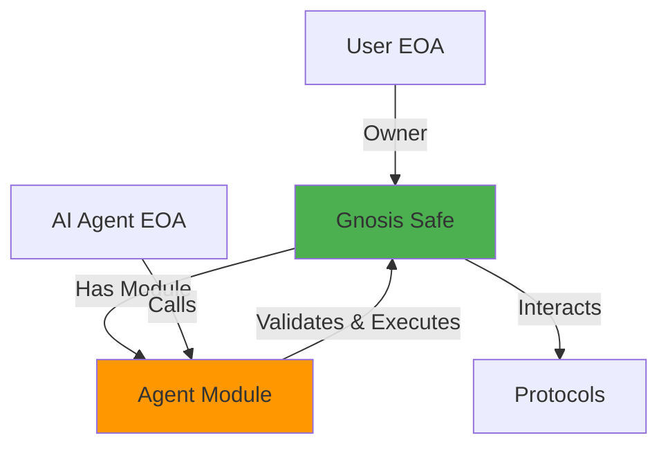
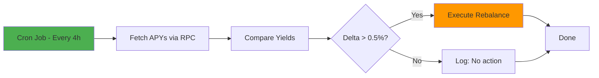

# Kimera DeFAI - Simplified Architecture Options

**Goal:** Reduce complexity, cost, and development time while maintaining core value proposition

---

## Current Architecture Complexity Analysis

### Complexity Hotspots

| Component | Complexity Level | Cost Impact | Risk Level |
|-----------|-----------------|-------------|------------|
| **ERC-4337 (Account Abstraction)** | 🔴 Very High | $12k-18k | High (untested on Flare) |
| **ERC-7579 (Session Keys Module)** | 🔴 Very High | $10k-15k | Medium |
| **Bundler Infrastructure** | 🟠 High | $3k-5k | High (availability uncertain) |
| **Protocol Adapters** | 🟡 Medium | $4k-6k | Low |
| **AI Agent (multi-source data)** | 🟡 Medium | $10k-15k | Low |
| **Frontend** | 🟢 Low | $8k-12k | Low |

**Total Current Estimate:** $58k-72k over 7 weeks

### Why Is ERC-4337 Complex?

```
User Action → Frontend → Sign UserOp → Bundler → Simulate → Submit to EntryPoint
→ Validate on Smart Account → Check Session Key Module → Execute

vs. Simple Approach:

User Action → Frontend → Sign Transaction → Submit to RPC → Execute on Smart Vault
```

**ERC-4337 adds:**
- Bundler dependency (availability risk on Flare)
- EntryPoint contract integration
- Gas estimation complexity
- UserOperation structure vs. standard transactions
- Paymaster integration (if gas abstraction needed)

---

## Simplified Architecture Options

### Option 1: Smart Vault with Allowance Pattern ⭐ RECOMMENDED

**Concept:** Replace ERC-4337 with a simple Smart Vault that uses standard ERC20 allowance mechanism.

#### Architecture Diagram

```mermaid
graph TB
    USER[User EOA] -->|1. Deposits FXRP| VAULT[Smart Vault Contract]
    USER -->|2. Approves Agent| VAULT

    subgraph "Smart Vault"
        OWNER[Owner: User EOA]
        AGENT_ROLE[Agent Role: AI Address]
        ALLOWLIST[Protocol Allowlist]
        BALANCE[User Balances]
    end

    subgraph "AI Agent (Off-Chain)"
        STRATEGY[Strategy Engine]
        EXECUTOR[Transaction Executor]
        AGENT_EOA[Agent EOA Wallet]
    end

    subgraph "Protocols"
        KINETIC[Kinetic]
        FIRELIGHT[Firelight]
    end

    VAULT -->|Holds| BALANCE
    USER -->|Sets allowlist| ALLOWLIST
    USER -->|Grants permission| AGENT_ROLE

    STRATEGY -->|Decides rebalance| EXECUTOR
    EXECUTOR -->|Signs with| AGENT_EOA
    AGENT_EOA -->|Calls vault.rebalance()| VAULT

    VAULT -->|Validates caller = agent| AGENT_ROLE
    VAULT -->|Validates target in| ALLOWLIST
    VAULT -->|Executes| KINETIC
    VAULT -->|Executes| FIRELIGHT

    USER -->|Can always withdraw| VAULT
    USER -->|Can revoke agent| AGENT_ROLE

    style VAULT fill:#4CAF50
    style AGENT_ROLE fill:#FF9800
    style ALLOWLIST fill:#2196F3
```

#### Smart Contract Code (Simplified)

```solidity
// SPDX-License-Identifier: MIT
pragma solidity ^0.8.23;

import "@openzeppelin/contracts/token/ERC20/IERC20.sol";
import "@openzeppelin/contracts/access/Ownable.sol";
import "@openzeppelin/contracts/security/ReentrancyGuard.sol";

contract KimeraVault is Ownable, ReentrancyGuard {
    IERC20 public immutable FXRP;

    // User => total deposited
    mapping(address => uint256) public balances;

    // User => agent address
    mapping(address => address) public authorizedAgents;

    // User => protocol => allowed
    mapping(address => mapping(address => bool)) public allowedProtocols;

    // Events
    event Deposited(address indexed user, uint256 amount);
    event Withdrawn(address indexed user, uint256 amount);
    event AgentAuthorized(address indexed user, address indexed agent);
    event AgentRevoked(address indexed user);
    event Rebalanced(address indexed user, address fromProtocol, address toProtocol, uint256 amount);

    constructor(address _fxrp) {
        FXRP = IERC20(_fxrp);
    }

    // ===== USER FUNCTIONS =====

    function deposit(uint256 amount) external nonReentrant {
        require(FXRP.transferFrom(msg.sender, address(this), amount), "Transfer failed");
        balances[msg.sender] += amount;
        emit Deposited(msg.sender, amount);
    }

    function withdraw(uint256 amount) external nonReentrant {
        require(balances[msg.sender] >= amount, "Insufficient balance");
        balances[msg.sender] -= amount;
        require(FXRP.transfer(msg.sender, amount), "Transfer failed");
        emit Withdrawn(msg.sender, amount);
    }

    function authorizeAgent(address agent) external {
        authorizedAgents[msg.sender] = agent;
        emit AgentAuthorized(msg.sender, agent);
    }

    function revokeAgent() external {
        delete authorizedAgents[msg.sender];
        emit AgentRevoked(msg.sender);
    }

    function setProtocolAllowlist(address protocol, bool allowed) external {
        allowedProtocols[msg.sender][protocol] = allowed;
    }

    // ===== AGENT FUNCTIONS =====

    function rebalance(
        address user,
        address fromProtocol,
        address toProtocol,
        uint256 amount,
        bytes calldata withdrawData,
        bytes calldata depositData
    ) external nonReentrant {
        // Validate agent authorization
        require(msg.sender == authorizedAgents[user], "Not authorized agent");

        // Validate protocols are in allowlist
        require(allowedProtocols[user][fromProtocol], "From protocol not allowed");
        require(allowedProtocols[user][toProtocol], "To protocol not allowed");

        // Validate user has sufficient balance
        require(balances[user] >= amount, "Insufficient balance");

        // Execute withdrawal from old protocol
        if (fromProtocol != address(0)) {
            (bool success, ) = fromProtocol.call(withdrawData);
            require(success, "Withdraw failed");
        }

        // Execute deposit to new protocol
        if (toProtocol != address(0)) {
            FXRP.approve(toProtocol, amount);
            (bool success, ) = toProtocol.call(depositData);
            require(success, "Deposit failed");
        }

        emit Rebalanced(user, fromProtocol, toProtocol, amount);
    }

    // ===== VIEW FUNCTIONS =====

    function getBalance(address user) external view returns (uint256) {
        return balances[user];
    }

    function isAgentAuthorized(address user, address agent) external view returns (bool) {
        return authorizedAgents[user] == agent;
    }
}
```

#### How It Works

**Setup Flow:**
```
1. User deposits FXRP to vault
2. User sets protocol allowlist: [Kinetic ✓, Firelight ✓]
3. User authorizes AI agent address
4. AI agent can now rebalance within constraints
```

**Execution Flow:**
```
1. AI agent detects better yield on Firelight
2. AI agent calls vault.rebalance(user, Kinetic, Firelight, 1000 FXRP)
3. Vault checks:
   - Is caller the authorized agent? ✓
   - Is Kinetic in user's allowlist? ✓
   - Is Firelight in user's allowlist? ✓
   - Does user have 1000 FXRP? ✓
4. Vault executes: withdraw from Kinetic, deposit to Firelight
5. User sees update in dashboard
```

**Security:**
- User maintains full ownership (can withdraw anytime)
- Agent cannot move funds to non-approved protocols
- Agent cannot withdraw to itself or other addresses
- User can revoke agent permission instantly

#### Pros & Cons

**Pros:**
- ✅ **Much simpler:** Standard transactions, no bundlers
- ✅ **Proven pattern:** Used by Yearn, Beefy, etc.
- ✅ **Lower cost:** $30k-40k vs $58k-72k
- ✅ **Faster development:** 4 weeks vs 7 weeks
- ✅ **No Flare ERC-4337 risk:** Works on any EVM chain
- ✅ **Easier to audit:** ~200 lines vs 500+ lines

**Cons:**
- ❌ User pays gas (no gas abstraction)
- ❌ Agent needs ETH/FLR for gas (operational cost)
- ❌ Less "fancy" (no AA magic)
- ❌ Agent is an EOA (key management required)

---

### Option 2: Hybrid - Safe Multisig with Agent Module

**Concept:** Use Gnosis Safe with a custom agent module (simpler than full ERC-4337).



**Code:**
```solidity
contract AgentModule {
    Safe public safe;
    address public agent;
    mapping(address => bool) public allowedProtocols;

    function rebalance(
        address toProtocol,
        bytes calldata data
    ) external {
        require(msg.sender == agent, "Not agent");
        require(allowedProtocols[toProtocol], "Protocol not allowed");

        // Execute via Safe
        require(safe.execTransactionFromModule(
            toProtocol,
            0,
            data,
            Enum.Operation.Call
        ), "Execution failed");
    }
}
```

**Pros:**
- ✅ Battle-tested Safe infrastructure
- ✅ Simpler than ERC-4337
- ✅ Modular architecture (can add features later)
- ✅ Good UX (Safe has wallet integrations)

**Cons:**
- ❌ Still complex (Safe + module)
- ❌ Higher gas costs than simple vault
- ❌ User still pays gas

**Cost:** $40k-50k | **Timeline:** 5-6 weeks

---

### Option 3: Minimal - Direct Approval to Agent (Not Recommended)

**Concept:** User approves FXRP directly to agent, agent executes on behalf.

```solidity
// User approves FXRP to agent EOA
FXRP.approve(agentAddress, amount);

// Agent calls protocols directly
KineticProtocol.deposit(amount); // Agent acts as user
```

**Pros:**
- ✅ Simplest possible architecture
- ✅ Lowest cost: $20k-25k
- ✅ Fastest: 3 weeks

**Cons:**
- ❌ **NOT NON-CUSTODIAL** - Agent has full token control
- ❌ User cannot set protocol restrictions
- ❌ High trust requirement
- ❌ Not suitable for public product

**Verdict:** ❌ Violates core requirement of non-custodial design.

---

## Simplified Off-Chain Agent

### Current Complexity:
```
Multiple data sources → Cache → Normalizer → Strategy Engine → Executor
(Subgraphs + RPC + APIs)
```

### Simplified Approach:



**Code (Python):**
```python
import time
from web3 import Web3

# Simple configuration
PROTOCOLS = {
    "Kinetic": "0x...",
    "Firelight": "0x..."
}

def fetch_apy(protocol_address):
    """Direct RPC call to protocol contract"""
    contract = w3.eth.contract(address=protocol_address, abi=PROTOCOL_ABI)
    return contract.functions.getAPY().call() / 100  # Returns APY as percentage

def optimize_yield(user_address):
    # 1. Get current position
    current_protocol = vault.functions.getUserPosition(user_address).call()

    # 2. Fetch all APYs
    apys = {name: fetch_apy(addr) for name, addr in PROTOCOLS.items()}

    # 3. Find best
    best_protocol = max(apys, key=apys.get)

    # 4. Check if worth rebalancing
    if apys[best_protocol] - apys[current_protocol] > 0.5:
        # Execute rebalance
        vault.functions.rebalance(
            user_address,
            PROTOCOLS[current_protocol],
            PROTOCOLS[best_protocol],
            amount
        ).transact({"from": agent_address})

        print(f"Rebalanced to {best_protocol} (+{delta}% APY)")
    else:
        print("No action needed")

# Run every 4 hours
while True:
    for user in get_active_users():
        optimize_yield(user)
    time.sleep(4 * 3600)
```

**Simplifications:**
- ❌ No subgraphs (just RPC calls)
- ❌ No caching layer (call directly)
- ❌ No complex ML (simple max function)
- ❌ No retry queues (fail fast)
- ✅ ~100 lines of code vs 500+

**Cost Impact:** $10k-15k → **$5k-8k**

---

## Simplified Frontend

### Current Complexity:
- Wallet connection for multiple wallets
- Smart account deployment flow
- Session key creation UI
- Complex dashboard

### Simplified Approach:

**3 Simple Pages:**

1. **Connect & Deposit**
```
┌─────────────────────────────────┐
│ Connect Wallet [MetaMask] 🦊    │
│                                 │
│ Deposit FXRP:  [____] [Deposit]│
│ Your Balance: 1,234 FXRP        │
│                                 │
│ [✓] I authorize AI to rebalance │
│     within approved protocols   │
│                                 │
│ Approved Protocols:             │
│ [✓] Kinetic (5.2% APY)         │
│ [✓] Firelight (6.8% APY)       │
│                                 │
│      [Start Optimizing]         │
└─────────────────────────────────┘
```

2. **Dashboard**
```
┌─────────────────────────────────┐
│ Your Portfolio: 1,234 FXRP      │
│ Current APY: 6.8%               │
│ Currently in: Firelight         │
│                                 │
│ Last 5 Actions:                 │
│ • 2h ago: Moved to Firelight    │
│ • 1d ago: Stayed in Kinetic     │
│                                 │
│ [Withdraw All] [Stop Agent]     │
└─────────────────────────────────┘
```

3. **Settings**
```
┌─────────────────────────────────┐
│ Agent Status: ✓ Active          │
│                                 │
│ Manage Protocols:               │
│ [✓] Kinetic                     │
│ [✓] Firelight                   │
│ [ ] Vault X                     │
│                                 │
│ Emergency Actions:              │
│ [Revoke Agent Access]           │
│ [Withdraw All Funds]            │
└─────────────────────────────────┘
```

**Tech Stack:**
- Next.js (React)
- RainbowKit (wallet connection)
- Tailwind CSS (styling)
- No complex state management

**Cost Impact:** $8k-12k → **$5k-7k**

---

## Comparison Matrix

| Aspect | Current (ERC-4337) | Option 1: Simple Vault | Option 2: Safe Module |
|--------|-------------------|----------------------|---------------------|
| **Development Cost** | $58k-72k | **$30k-40k** | $40k-50k |
| **Timeline** | 7 weeks | **4 weeks** | 5-6 weeks |
| **Smart Contract Complexity** | Very High | Low | Medium |
| **Lines of Solidity** | ~500 | **~200** | ~350 |
| **External Dependencies** | Bundler, EntryPoint | None | Safe contracts |
| **Flare-Specific Risk** | High | **None** | Low |
| **Gas Abstraction** | Possible | No | No |
| **Non-Custodial** | ✅ | ✅ | ✅ |
| **User Control** | ✅ | ✅ | ✅ |
| **Audit Difficulty** | High | **Low** | Medium |
| **Future Extensibility** | High | Medium | High |

---

## Detailed Cost Breakdown - Simplified Architecture (Option 1)

### Development Costs

| Component | Current | Simplified | Savings |
|-----------|---------|------------|---------|
| **Smart Contracts** | | | |
| ERC-4337 validation | $2k-3k | $0 | -$2.5k |
| Smart Account | $8k-12k | $0 | -$10k |
| Session Key Module | $10k-15k | $0 | -$12.5k |
| Simple Vault | $0 | $5k-7k | -$5k (net) |
| Protocol Adapters | $4k-6k | $3k-4k | -$1.5k |
| **Subtotal Contracts** | **$24k-36k** | **$8k-11k** | **-$20k** |
| | | | |
| **Off-Chain Agent** | | | |
| Data ingestion | $5k-7k | $2k-3k | -$3.5k |
| Strategy engine | $5k-8k | $2k-3k | -$4k |
| Execution service | $5k-8k | $2k-3k | -$4k |
| **Subtotal Agent** | **$15k-23k** | **$6k-9k** | **-$11.5k** |
| | | | |
| **Frontend** | $8k-12k | $5k-7k | -$3.5k |
| **Testing & Security** | $9k-11k | $5k-7k | -$3k |
| **DevOps** | $5k-8k | $3k-4k | -$2.5k |
| | | | |
| **TOTAL** | **$61k-90k** | **$27k-38k** | **-$40.5k** |

**Recommended Budget (Simplified):** $35k with buffer

---

## Timeline Comparison

### Current Architecture (7 weeks)
```
Week 1: ERC-4337 validation
Week 2-3: Smart Account + Session Keys
Week 4: Protocol Adapters
Week 5: AI Agent
Week 6: Frontend
Week 7: Testing & hardening
```

### Simplified Architecture (4 weeks)
```
Week 1: Simple Vault + Protocol integration
Week 2: AI Agent + AWS setup
Week 3: Frontend + integration
Week 4: Testing + deployment
```

**Time Savings:** 3 weeks (43% faster)

---

## Risk Comparison

| Risk Category | Current | Simplified |
|--------------|---------|------------|
| **Technical Complexity** | 🔴 High - Novel tech stack | 🟢 Low - Proven patterns |
| **Flare Compatibility** | 🔴 High - Untested AA infra | 🟢 None - Standard EVM |
| **External Dependencies** | 🟠 Medium - Bundler required | 🟢 None |
| **Audit Scope** | 🔴 Large - 500+ LOC | 🟢 Small - 200 LOC |
| **Gas Costs** | 🟢 Low (if paymaster) | 🟠 Medium (user pays) |
| **Key Management** | 🟢 Session keys | 🟠 Agent EOA |

---

## Recommendation

### ⭐ Go with Option 1: Simple Vault Architecture

**Rationale:**

1. **Faster Time-to-Market:** 4 weeks vs 7 weeks
2. **Lower Cost:** $35k vs $65k (saves $30k or 46%)
3. **Lower Risk:** No dependency on untested Flare AA infrastructure
4. **Easier to Audit:** Simpler code = faster, cheaper audit
5. **Proven Pattern:** Used by major DeFi protocols

**What You Lose:**
- Gas abstraction (user pays transaction fees)
- "Account Abstraction" marketing appeal
- Some future extensibility (but can migrate later)

**What You Gain:**
- Faster launch → earlier user feedback
- More budget for marketing/growth
- Confidence in technical feasibility
- Simpler debugging and maintenance

### Migration Path to Full AA (Phase 2)

If the PoC succeeds, you can upgrade:

```
Phase 1 (Now): Simple Vault
                ↓
Phase 2 (6mo): Add Safe integration
                ↓
Phase 3 (12mo): Full ERC-4337 when Flare AA is mature
```

This progressive enhancement approach de-risks the PoC while keeping future options open.

---

## Action Items

### If You Choose Simplified Architecture:

**Week 1:**
1. Deploy Simple Vault on Coston2
2. Integrate Kinetic + Firelight
3. Create agent EOA and fund with gas

**Week 2:**
4. Build AI agent (Python script)
5. Test rebalancing on testnet
6. Set up AWS Lambda for scheduling

**Week 3:**
7. Build frontend (3 pages)
8. Integration testing
9. User acceptance testing

**Week 4:**
10. Security review
11. Fix issues
12. Deploy to mainnet
13. Onboard first users

**Budget:** $35k | **Timeline:** 4 weeks

---

## Technical Debt Considerations

### What Gets Simpler (Good Debt):
- ✅ Remove bundler complexity
- ✅ Remove UserOperation encoding
- ✅ Remove modular account architecture
- ✅ Remove gas estimation complexity

### What Gets More Complex (Bad Debt):
- ❌ Agent needs gas management (must monitor FLR balance)
- ❌ Agent private key security (vs session key rotation)
- ❌ No built-in transaction batching

### Mitigation:
```python
# Gas monitoring
def check_agent_balance():
    balance = w3.eth.get_balance(agent_address)
    if balance < MINIMUM_BALANCE:
        alert_team("Agent needs gas top-up")

# Key security
# Use AWS KMS or Secrets Manager for agent key
# Rotate key every 30 days
# Use separate keys for testnet/mainnet
```

---

## Final Recommendation

**Start Simple. Iterate to Complex.**

Build the Simple Vault architecture for Phase 1:
- Proven technology
- 4 weeks to market
- $35k budget
- Low technical risk

Monitor these success metrics:
- User adoption
- Total value locked
- Average yield improvement
- User satisfaction with UX

If successful after 3-6 months:
- Invest in AA upgrade (Phase 2)
- Add gas abstraction
- Improve UX further

**Remember:** The core value is "AI optimizes my yield automatically." Users don't care if you use ERC-4337 or a simple vault—they care about returns and safety.

Ship fast. Learn fast. Iterate.

---

**Questions?**

1. Should we prototype the Simple Vault this week?
2. Do you want to see a detailed contract implementation?
3. Should I create a comparison demo of both approaches?
