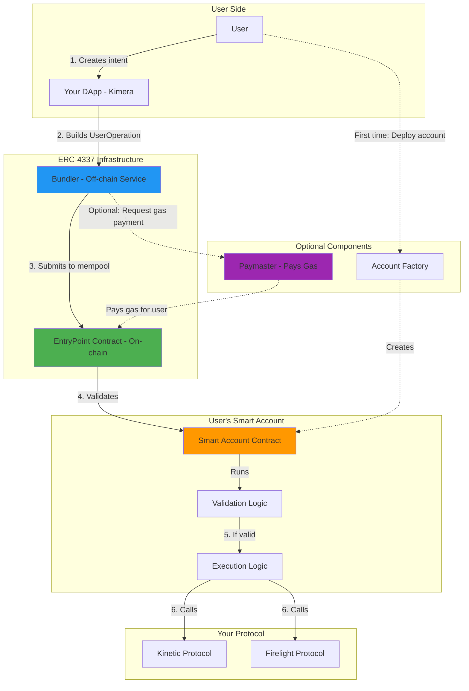
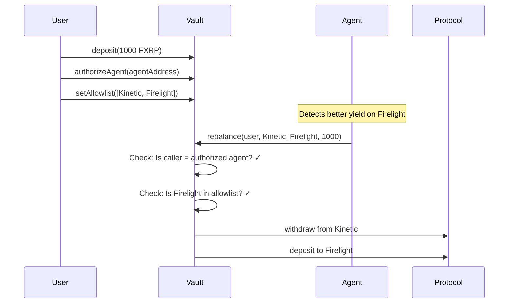
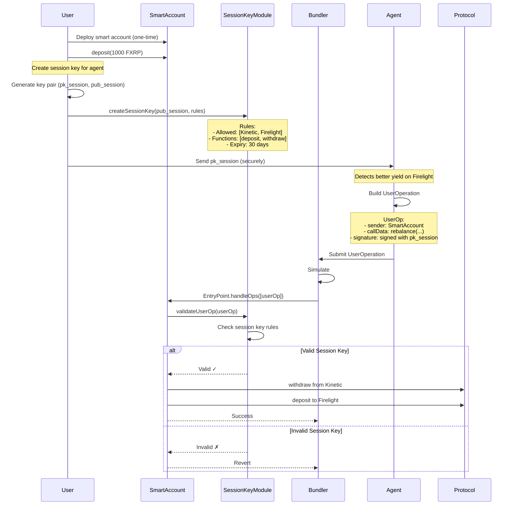

# ERC-4337 Account Abstraction - Explained for Kimera

**Your Question:** What is ERC-4337 and should I use it?

**Short Answer:** ERC-4337 turns your user's wallet into a smart contract with programmable rules. It's powerful but complex and potentially overkill for your PoC.

---

## What is ERC-4337?

### The Traditional Problem

**Normal Ethereum/EVM wallets (EOAs - Externally Owned Accounts):**
```
User has private key → Signs transaction → Pays gas in native token (ETH/FLR)
```

**Limitations:**
- ❌ User MUST hold native tokens (ETH/FLR) to pay gas
- ❌ Cannot customize transaction validation (e.g., "only allow this contract")
- ❌ Cannot delegate signing to another party safely
- ❌ Cannot batch multiple operations atomically
- ❌ Lost private key = lost funds forever
- ❌ No social recovery

### The ERC-4337 Solution

ERC-4337 makes **Smart Contract Wallets** work without changing the core Ethereum protocol.

**Your wallet becomes a smart contract with programmable logic:**
```
User intent → Smart Account validates → Executes with custom rules
```

**Benefits:**
- ✅ **Gas abstraction:** Someone else can pay gas (or pay in USDC instead of ETH)
- ✅ **Session keys:** Delegate limited permissions to apps/bots
- ✅ **Batching:** Multiple actions in one transaction
- ✅ **Social recovery:** Recover account via friends/guardians
- ✅ **Custom validation:** Programmable rules for what's allowed
- ✅ **Better UX:** Users don't need to understand gas, nonces, etc.

---

## How ERC-4337 Works (Technical Flow)

### Architecture Overview



### Step-by-Step Flow

#### 1. User Creates Intent
```javascript
// User wants to: "Deposit 100 FXRP into Kinetic"
const intent = {
  action: "deposit",
  protocol: "Kinetic",
  amount: 100
}
```

#### 2. DApp Builds UserOperation

A `UserOperation` is like a transaction, but richer:

```javascript
const userOp = {
  sender: "0xYourSmartAccount",           // Your smart account address
  nonce: 5,                                // Anti-replay
  initCode: "0x",                          // Empty (account already deployed)
  callData: "0xABCD...",                   // Encoded: deposit(100)
  callGasLimit: 100000,                    // Gas for execution
  verificationGasLimit: 200000,            // Gas for validation
  preVerificationGas: 21000,               // Base gas cost
  maxFeePerGas: "30 gwei",
  maxPriorityFeePerGas: "2 gwei",
  paymasterAndData: "0x",                  // Empty = user pays
  signature: "0x123..."                    // Signed by user or session key
}
```

**Key Difference vs Normal Transaction:**
- Normal TX: `{to, value, data, gas, nonce, signature}`
- UserOp: **Separate gas for validation vs execution**, **paymaster support**, **factory for account creation**

#### 3. Bundler Receives UserOperation

**What's a Bundler?**
- Off-chain service (like a mempool aggregator)
- Collects multiple UserOperations from different users
- Simulates them to ensure they're valid
- Bundles them into ONE normal transaction
- Submits to the `EntryPoint` contract

**Why Bundlers?**
- Users don't submit transactions directly (their smart account can't sign TX)
- Bundler acts as intermediary
- Can optimize gas by batching multiple users

```
Bundler receives:
  - UserOp from Alice
  - UserOp from Bob
  - UserOp from Charlie

Bundler creates ONE transaction:
  → EntryPoint.handleOps([Alice's op, Bob's op, Charlie's op])
```

#### 4. EntryPoint Validates

The `EntryPoint` is the core ERC-4337 contract (one per chain):

```solidity
contract EntryPoint {
    function handleOps(UserOperation[] calldata ops, address payable beneficiary) external {
        for (UserOperation op : ops) {
            // 1. Validate the operation
            uint256 validationData = IAccount(op.sender).validateUserOp(op, hash, missingFunds);

            // 2. If valid, execute
            if (validationData == 0) {
                IAccount(op.sender).execute(op.callData);
            }
        }
    }
}
```

#### 5. Smart Account Validates

Your Smart Account must implement validation:

```solidity
contract MySmartAccount {
    address public owner;

    function validateUserOp(
        UserOperation calldata userOp,
        bytes32 userOpHash,
        uint256 missingAccountFunds
    ) external returns (uint256 validationData) {
        // Check 1: Is signature valid?
        bytes32 hash = userOpHash.toEthSignedMessageHash();
        address signer = hash.recover(userOp.signature);

        if (signer == owner) {
            return 0; // Valid
        }

        // Check 2: Is it a session key?
        if (sessionKeys[signer].isValid && block.timestamp < sessionKeys[signer].expiry) {
            // Check if target is in allowlist
            address target = parseTarget(userOp.callData);
            if (sessionKeys[signer].allowedTargets.contains(target)) {
                return 0; // Valid
            }
        }

        return 1; // Invalid
    }

    function execute(bytes calldata data) external {
        // Only EntryPoint can call this
        require(msg.sender == ENTRYPOINT, "Only EntryPoint");

        // Decode and execute
        (address target, uint256 value, bytes memory callData) = abi.decode(data, (address, uint256, bytes));
        (bool success, ) = target.call{value: value}(callData);
        require(success, "Execution failed");
    }
}
```

#### 6. Execution

If validation passes, the Smart Account executes the intended action:

```solidity
// Smart Account calls Kinetic Protocol
KineticProtocol.deposit(100 FXRP);
```

---

## How This Applies to Kimera

### Scenario: User Authorizes AI Agent

#### Without ERC-4337 (Simple Vault)



**Agent needs:**
- Private key (EOA)
- FLR to pay gas
- Permission from vault

**Security:**
- Vault validates agent address
- Vault validates target protocols
- User can revoke anytime

---

#### With ERC-4337 (Smart Account + Session Keys)



**Agent needs:**
- Session key private key (NOT user's main key)
- NO gas (paymaster can sponsor)
- Time-limited permissions

**Security:**
- Session key has restricted permissions
- Cannot transfer to arbitrary addresses
- Auto-expires after 30 days
- User can revoke instantly

---

## Key Components Explained

### 1. Smart Account (Your User's Wallet)

```solidity
interface IAccount {
    function validateUserOp(
        UserOperation calldata userOp,
        bytes32 userOpHash,
        uint256 missingAccountFunds
    ) external returns (uint256 validationData);
}
```

**Your implementation:**
```solidity
contract KimeraSmartAccount is IAccount {
    address public owner;
    ISessionKeyModule public sessionKeyModule;

    function validateUserOp(...) external returns (uint256) {
        // Option 1: Owner signed it
        if (recoverSigner(userOp) == owner) return 0;

        // Option 2: Session key signed it
        if (sessionKeyModule.isValidSessionKey(userOp)) return 0;

        return 1; // Invalid
    }
}
```

### 2. Session Key Module (ERC-7579)

```solidity
contract SessionKeyModule {
    struct SessionKey {
        address key;
        address[] allowedContracts;  // [Kinetic, Firelight]
        bytes4[] allowedFunctions;   // [deposit.selector, withdraw.selector]
        uint256 validUntil;          // Expiry timestamp
    }

    mapping(address => mapping(address => SessionKey)) public sessionKeys;

    function createSessionKey(
        address smartAccount,
        address sessionKey,
        address[] calldata allowedContracts,
        bytes4[] calldata allowedFunctions,
        uint256 validUntil
    ) external {
        require(msg.sender == smartAccount, "Only account");
        sessionKeys[smartAccount][sessionKey] = SessionKey({
            key: sessionKey,
            allowedContracts: allowedContracts,
            allowedFunctions: allowedFunctions,
            validUntil: validUntil
        });
    }

    function validateSessionKey(
        address smartAccount,
        UserOperation calldata userOp
    ) external view returns (bool) {
        address signer = recoverSigner(userOp);
        SessionKey memory sk = sessionKeys[smartAccount][signer];

        // Check expiry
        if (block.timestamp > sk.validUntil) return false;

        // Parse target contract from callData
        address target = parseTarget(userOp.callData);
        if (!isInArray(target, sk.allowedContracts)) return false;

        // Parse function selector
        bytes4 selector = parseSelector(userOp.callData);
        if (!isInArray(selector, sk.allowedFunctions)) return false;

        return true;
    }
}
```

### 3. Bundler (Off-chain Service)

You don't build this - you use existing ones:
- **Stackup** bundler
- **Alchemy** bundler
- **Biconomy** bundler
- **Etherspot** bundler (claims Flare support)

**What bundlers do:**
```javascript
// Bundler receives UserOp
bundler.receiveUserOp(userOp)

// Simulate to check validity
const simulation = await entryPoint.callStatic.simulateValidation(userOp)
if (simulation.failed) throw "Invalid UserOp"

// Add to mempool
bundler.mempool.add(userOp)

// Every few seconds: bundle and submit
const userOps = bundler.mempool.getBatch()
await entryPoint.handleOps(userOps, bundlerAddress)
```

### 4. Paymaster (Optional - Gas Abstraction)

Allows someone else to pay gas:

```solidity
contract KimeraPaymaster {
    function validatePaymasterUserOp(
        UserOperation calldata userOp,
        bytes32 userOpHash,
        uint256 maxCost
    ) external returns (bytes memory context, uint256 validationData) {
        // Check: Is this a Kimera user?
        if (kimeraUsers[userOp.sender]) {
            // We'll pay for their gas
            return ("", 0);
        }
        return ("", 1); // Don't pay
    }
}
```

**User experience:**
```
WITHOUT paymaster:
User needs FLR to pay gas → friction

WITH paymaster:
Kimera pays gas → user only needs FXRP → better UX
```

---

## Should YOU Use ERC-4337 for Kimera?

### ✅ Reasons TO Use ERC-4337

**1. Better UX - Gas Abstraction**
```
User only needs FXRP, doesn't need FLR for gas
→ Kimera paymaster covers gas fees
→ Smoother onboarding
```

**2. Security - Session Keys**
```
User creates temporary key for AI agent
→ Agent can't steal funds (only rebalance)
→ Auto-expires after 30 days
→ User can revoke anytime
```

**3. Advanced Features**
- Batch multiple rebalances in one transaction
- Social recovery (recover account via guardians)
- Spending limits (max $X per day)
- Multi-sig support (require 2 signatures)

**4. Future-Proofing**
- Industry is moving toward AA
- Better wallet compatibility (Argent, Safe, etc.)
- More infrastructure coming

---

### ❌ Reasons NOT TO Use ERC-4337 (For PoC)

**1. Complexity**
```
Components: Smart Account + Factory + SessionKey Module + Bundler integration + Paymaster
Lines of code: ~500-800
vs. Simple Vault: ~200 lines
```

**2. Flare Risk**
```
Question: Is there a production bundler on Flare?
→ Etherspot claims support, but unverified
→ If no bundler → you must build one (+$10k-15k)
→ Or it doesn't work at all
```

**3. Cost**
```
ERC-4337 development: $25k-35k
Simple vault: $8k-12k
Savings: $15k-20k
```

**4. Time**
```
ERC-4337: 4-5 weeks
Simple vault: 1-2 weeks
```

**5. Gas Costs**
```
ERC-4337 transaction: ~300k-500k gas
Normal transaction: ~100k-200k gas

Even with paymaster, YOU pay more per rebalance
```

**6. Audit Complexity**
```
More code = more attack surface
Longer audit time = higher cost
```

---

## The Practical Answer for Kimera

### My Recommendation: **Start Without ERC-4337**

**Phase 1 (Now):** Simple Vault
- User deposits to vault
- User authorizes agent address
- Agent rebalances within allowlist
- Cost: $35k | Time: 4 weeks

**Success Metrics:**
- 100+ users
- $1M+ TVL
- Positive user feedback

**Phase 2 (6-12 months):** Add ERC-4337
- Migrate to Smart Accounts
- Add paymaster for gas abstraction
- Improve UX based on Phase 1 learnings

### Why This Makes Sense

**1. De-risk the PoC**
- Prove the core value: "AI optimizes yield"
- Don't get blocked by infrastructure issues

**2. Learn from users**
- Do they care about gas abstraction?
- Is session key complexity worth it?
- What features do they actually want?

**3. Progressive enhancement**
```
v1.0: Simple vault (works everywhere)
  ↓ Learn & iterate
v2.0: Smart accounts (better UX)
  ↓ Learn & iterate
v3.0: Full AA with all features
```

**4. Budget allocation**
```
Option A: $65k on ERC-4337 → might get stuck on bundler
Option B: $35k on simple vault + $30k on marketing
→ Option B = more users, faster feedback
```

---

## What If You REALLY Want ERC-4337?

### Pre-Requirements (Week 1 - MUST DO FIRST)

**Validate Flare AA Infrastructure:**

```javascript
// Test on Coston2
const accountFactory = await ethers.getContractAt("SimpleAccountFactory", FACTORY_ADDRESS);
const account = await accountFactory.createAccount(owner, salt);

// Try to submit a UserOperation
const bundlerUrl = "https://flare-bundler.example.com"; // Does this exist?
const response = await fetch(bundlerUrl, {
  method: 'POST',
  body: JSON.stringify({
    jsonrpc: "2.0",
    method: "eth_sendUserOperation",
    params: [userOp, ENTRYPOINT_ADDRESS]
  })
});

// Did it work?
if (response.ok) {
  console.log("✅ Bundler works on Flare!");
} else {
  console.log("❌ No bundler - must build own or use alternative");
}
```

**Questions to answer:**
1. ✅ Is there a bundler service for Flare testnet/mainnet?
2. ✅ What are the gas costs compared to normal TX?
3. ✅ Does Etherspot SDK actually work on Flare?
4. ✅ Are there paymasters available?

**Cost:** $2k-3k for validation
**Time:** 3-5 days

**If validation FAILS → Use simple vault**
**If validation SUCCEEDS → Proceed with ERC-4337**

---

## Technical Resources

### If You Choose ERC-4337

**SDKs:**
- **Etherspot** - Claims Flare support
- **Alchemy Account Kit** - Might not support Flare
- **Biconomy** - Check Flare compatibility
- **ZeroDev** - Kernel-based accounts

**Bundlers:**
- Stackup
- Alchemy
- Pimlico
- Etherspot Skandha

**Sample Implementation:**
```bash
# Install Etherspot SDK
npm install @etherspot/prime-sdk

# Initialize
const primeSdk = new PrimeSdk(
  { privateKey: userPrivateKey },
  { chainId: 14, bundlerProvider: /* Flare bundler */ }
);

// Create session key
await primeSdk.addSessionKey(
  agentAddress,
  validUntil,
  allowedContracts,
  allowedFunctions
);

// Agent executes with session key
const userOp = await primeSdk.sendUserOp(
  { to: kineticAddress, data: depositCalldata },
  { sessionKey: agentPrivateKey }
);
```

---

## Summary Table

| Aspect | Simple Vault | ERC-4337 |
|--------|-------------|----------|
| **User pays gas?** | Yes (in FLR) | No (paymaster optional) |
| **Session keys?** | No (agent uses EOA) | Yes (restricted permissions) |
| **Development cost** | $35k | $65k |
| **Development time** | 4 weeks | 7 weeks |
| **Flare compatibility risk** | None | High |
| **Code complexity** | Low (~200 LOC) | High (~500 LOC) |
| **Gas per TX** | Lower | Higher |
| **Non-custodial?** | ✅ Yes | ✅ Yes |
| **Future extensibility** | Medium | High |
| **Recommended for PoC?** | ✅ **YES** | ⚠️ Maybe |

---

## Final Recommendation

**For Kimera Phase 1 PoC:**

### Go with Simple Vault

**Reasons:**
1. ✅ Faster to market (4 weeks vs 7 weeks)
2. ✅ Lower cost ($35k vs $65k)
3. ✅ No Flare infrastructure risk
4. ✅ Easier to audit
5. ✅ Still achieves core value: automated yield optimization
6. ✅ Can upgrade to AA later if successful

**Trade-offs you accept:**
- ❌ User must have FLR for gas
- ❌ Agent uses EOA instead of session key
- ❌ No fancy "Account Abstraction" marketing

**But you gain:**
- ✅ Confidence it will work
- ✅ Faster user feedback
- ✅ More budget for growth

---

## Questions for You

1. **Do your target users care about gas abstraction?**
   - If they're already DeFi users → they have FLR → not critical
   - If they're new to crypto → gas abstraction is valuable

2. **Is ERC-4337 a marketing requirement?**
   - If Flare wants "first AA DeFAI" → might need it
   - If you just want users → simple vault works

3. **What's your risk tolerance?**
   - Low risk → Simple vault
   - Can handle delays → Try ERC-4337

