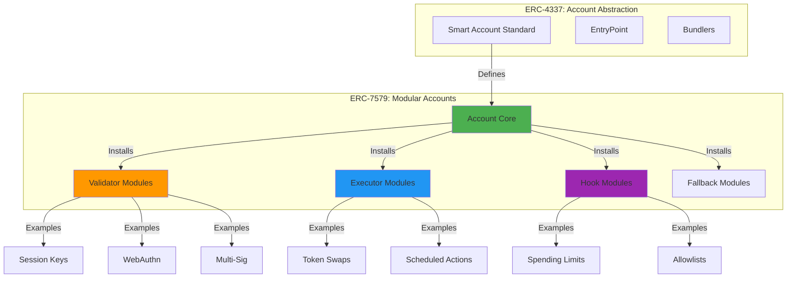
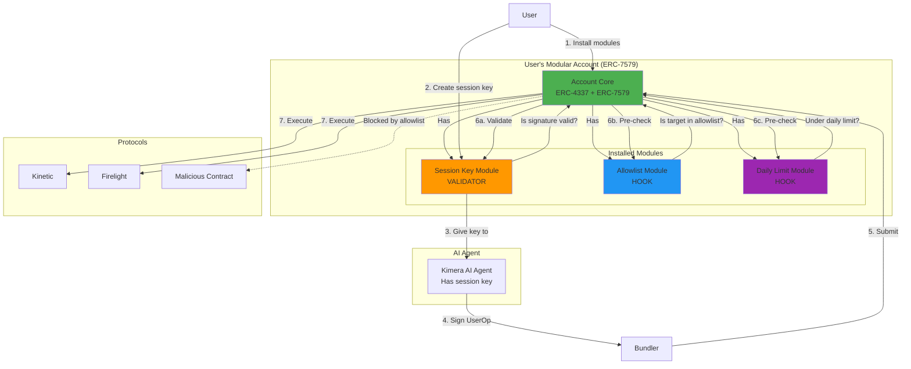
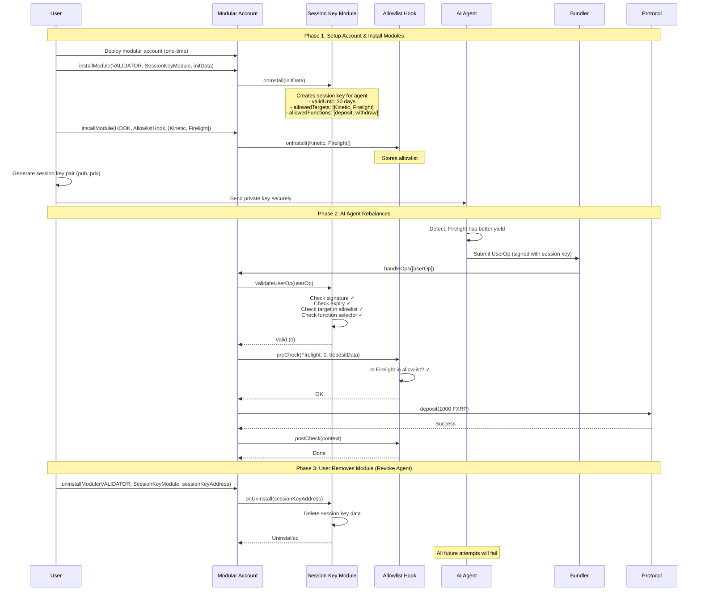

# ERC-7579 Modular Smart Accounts - Explained for Kimera

**Your Question:** What is ERC-7579 and should I use it?

**Short Answer:** ERC-7579 is a standard for making Smart Accounts modular (like plugins). It lets you add/remove features like session keys, spending limits, or social recovery without redeploying your account. It's the "app store" for smart wallets.

---

## What is ERC-7579?

### The Problem It Solves

**Before ERC-7579:**
```
Your Smart Account = Monolithic contract with all features baked in

Want to add session keys? → Redeploy entire account
Want to add 2FA? → Redeploy entire account
Want to add spending limits? → Redeploy entire account
Want to upgrade? → Complex upgrade patterns
```

**With ERC-7579:**
```
Your Smart Account = Core + Pluggable Modules

Want session keys? → Install SessionKey module
Want 2FA? → Install WebAuthn module
Want spending limits? → Install SpendingLimit module
Don't need it anymore? → Uninstall the module
```

### ERC-7579 in One Sentence

**"The standard interface for pluggable modules in ERC-4337 smart accounts"**

It's like:
- Browser extensions for Chrome
- Plugins for WordPress
- Mods for Minecraft
- NPM packages for Node.js

But for smart contract wallets.

---

## How ERC-7579 Relates to ERC-4337

### The Relationship



**Relationship:**
- **ERC-4337** = How smart accounts work (validation + execution flow)
- **ERC-7579** = How to make those accounts modular (plug & play features)

**Analogy:**
- ERC-4337 = Operating System (iOS/Android)
- ERC-7579 = App Store (install/uninstall apps)

---

## Technical Architecture

### Module Types (4 Categories)

ERC-7579 defines **4 types of modules** that can be installed:

#### 1. **Validators** (Authentication)

**Purpose:** Decide if an operation is allowed

**Examples:**
- Session keys (your AI agent)
- WebAuthn (fingerprint/FaceID)
- Multi-signature (3-of-5 approvals)
- Social recovery (guardian approval)

**Interface:**
```solidity
interface IValidator {
    function validateUserOp(
        UserOperation calldata userOp,
        bytes32 userOpHash
    ) external returns (uint256 validationData);
}
```

**How it works:**
```
User wants to do action X
  ↓
Account asks all installed validators: "Is this OK?"
  ↓
Session Key Validator: "Yes, X is in allowlist" ✅
WebAuthn Validator: "Not my concern" ⏭️
  ↓
At least one validator approved → Execute
```

#### 2. **Executors** (Actions)

**Purpose:** Perform complex actions on behalf of the account

**Examples:**
- Automated swaps (swap USDC to DAI)
- Recurring payments (pay $100/month)
- Yield optimization (your Kimera AI agent!)
- Batch operations

**Interface:**
```solidity
interface IExecutor {
    function executeFromAccount(
        address target,
        uint256 value,
        bytes calldata data
    ) external returns (bytes memory);
}
```

**How it works:**
```
AI Agent (Executor module) decides: "Move funds to higher yield"
  ↓
Executor builds transaction: withdraw from Kinetic + deposit to Firelight
  ↓
Account validates via Validators
  ↓
If approved → Executor executes the batch
```

#### 3. **Hooks** (Pre/Post Checks)

**Purpose:** Run before/after every transaction (guardrails)

**Examples:**
- Spending limits ("max $100/day")
- Protocol allowlists ("only these addresses")
- Rate limiting ("max 5 TX/hour")
- Notifications (send alert on large TX)

**Interface:**
```solidity
interface IHook {
    function preCheck(
        address target,
        uint256 value,
        bytes calldata data
    ) external returns (bytes memory);

    function postCheck(bytes memory context) external;
}
```

**How it works:**
```
User tries to withdraw 10,000 FXRP
  ↓
PreHook: Spending Limit Module checks
  "Daily limit: $1,000. Already spent: $200. This TX: $10,000"
  → REVERT ❌

vs.

User tries to withdraw 500 FXRP
  ↓
PreHook: "500 < 1000. OK" ✅
  ↓
Execute withdrawal
  ↓
PostHook: Update spent amount to $700
```

#### 4. **Fallback Handlers** (Catch-all)

**Purpose:** Handle calls to functions the account doesn't implement

**Examples:**
- ERC-721 receiver (receive NFTs)
- ERC-1155 receiver
- Custom RPC methods

**Interface:**
```solidity
interface IFallback {
    function handle(
        address sender,
        uint256 value,
        bytes calldata data
    ) external returns (bytes memory);
}
```

---

## ERC-7579 Smart Account Structure

### Complete Architecture

```solidity
contract ModularSmartAccount {
    // ============ STATE ============
    address public owner;

    // Installed modules by type
    mapping(address => bool) public validators;
    mapping(address => bool) public executors;
    mapping(address => bool) public hooks;
    mapping(bytes4 => address) public fallbackHandlers;

    // ============ MODULE MANAGEMENT ============

    function installModule(
        uint256 moduleType,
        address module,
        bytes calldata initData
    ) external {
        require(msg.sender == address(this), "Only self");

        if (moduleType == MODULE_TYPE_VALIDATOR) {
            validators[module] = true;
            IValidator(module).onInstall(initData);
        } else if (moduleType == MODULE_TYPE_EXECUTOR) {
            executors[module] = true;
            IExecutor(module).onInstall(initData);
        } else if (moduleType == MODULE_TYPE_HOOK) {
            hooks[module] = true;
            IHook(module).onInstall(initData);
        }
        // ... fallback handling
    }

    function uninstallModule(
        uint256 moduleType,
        address module,
        bytes calldata deInitData
    ) external {
        require(msg.sender == address(this), "Only self");

        if (moduleType == MODULE_TYPE_VALIDATOR) {
            delete validators[module];
            IValidator(module).onUninstall(deInitData);
        }
        // ... other types
    }

    // ============ ERC-4337 VALIDATION ============

    function validateUserOp(
        UserOperation calldata userOp,
        bytes32 userOpHash,
        uint256 missingAccountFunds
    ) external returns (uint256) {
        // Check all installed validators
        address[] memory installedValidators = getValidators();

        for (uint i = 0; i < installedValidators.length; i++) {
            uint256 validationData = IValidator(installedValidators[i])
                .validateUserOp(userOp, userOpHash);

            if (validationData == 0) {
                return 0; // Valid!
            }
        }

        return 1; // No validator approved
    }

    // ============ EXECUTION WITH HOOKS ============

    function execute(
        address target,
        uint256 value,
        bytes calldata data
    ) external {
        // Run pre-hooks
        address[] memory installedHooks = getHooks();
        bytes[] memory hookContexts = new bytes[](installedHooks.length);

        for (uint i = 0; i < installedHooks.length; i++) {
            hookContexts[i] = IHook(installedHooks[i]).preCheck(target, value, data);
        }

        // Execute the call
        (bool success, bytes memory result) = target.call{value: value}(data);
        require(success, "Execution failed");

        // Run post-hooks
        for (uint i = 0; i < installedHooks.length; i++) {
            IHook(installedHooks[i]).postCheck(hookContexts[i]);
        }
    }
}
```

---

## How This Works for Kimera

### Kimera Use Case: Session Keys for AI Agent

Let's see how ERC-7579 would work for your specific need.

#### Architecture



#### Module Implementation

**1. Session Key Validator Module**

```solidity
contract SessionKeyValidatorModule is IValidator {
    struct SessionKeyData {
        address sessionKey;
        uint48 validUntil;
        uint48 validAfter;
        address[] allowedTargets;
        bytes4[] allowedFunctions;
    }

    // Account => session key => data
    mapping(address => mapping(address => SessionKeyData)) public sessionKeys;

    function onInstall(bytes calldata data) external override {
        // Called when account installs this module
        (address sessionKey, uint48 validUntil, address[] memory targets, bytes4[] memory funcs)
            = abi.decode(data, (address, uint48, address[], bytes4[]));

        sessionKeys[msg.sender][sessionKey] = SessionKeyData({
            sessionKey: sessionKey,
            validUntil: validUntil,
            validAfter: uint48(block.timestamp),
            allowedTargets: targets,
            allowedFunctions: funcs
        });
    }

    function validateUserOp(
        UserOperation calldata userOp,
        bytes32 userOpHash
    ) external view override returns (uint256) {
        // Recover signer from signature
        address signer = ECDSA.recover(
            userOpHash.toEthSignedMessageHash(),
            userOp.signature
        );

        SessionKeyData memory skData = sessionKeys[userOp.sender][signer];

        // Check if session key exists
        if (skData.sessionKey == address(0)) return 1; // Invalid

        // Check time bounds
        if (block.timestamp < skData.validAfter || block.timestamp > skData.validUntil) {
            return 1; // Expired
        }

        // Parse target and function from callData
        (address target, , bytes memory callData) = abi.decode(
            userOp.callData[4:], // Skip function selector
            (address, uint256, bytes)
        );

        // Check target allowlist
        bool targetAllowed = false;
        for (uint i = 0; i < skData.allowedTargets.length; i++) {
            if (skData.allowedTargets[i] == target) {
                targetAllowed = true;
                break;
            }
        }
        if (!targetAllowed) return 1; // Invalid

        // Check function allowlist
        bytes4 funcSelector = bytes4(callData);
        bool funcAllowed = false;
        for (uint i = 0; i < skData.allowedFunctions.length; i++) {
            if (skData.allowedFunctions[i] == funcSelector) {
                funcAllowed = true;
                break;
            }
        }
        if (!funcAllowed) return 1; // Invalid

        return 0; // Valid!
    }

    function onUninstall(bytes calldata data) external override {
        // Clean up when module is uninstalled
        address sessionKey = abi.decode(data, (address));
        delete sessionKeys[msg.sender][sessionKey];
    }
}
```

**2. Protocol Allowlist Hook Module**

```solidity
contract ProtocolAllowlistHook is IHook {
    // Account => allowed protocols
    mapping(address => mapping(address => bool)) public allowedProtocols;

    function onInstall(bytes calldata data) external override {
        address[] memory protocols = abi.decode(data, (address[]));
        for (uint i = 0; i < protocols.length; i++) {
            allowedProtocols[msg.sender][protocols[i]] = true;
        }
    }

    function preCheck(
        address target,
        uint256 value,
        bytes calldata data
    ) external view override returns (bytes memory) {
        // Check if target is in allowlist
        require(allowedProtocols[msg.sender][target], "Protocol not allowed");
        return ""; // No context needed for post-check
    }

    function postCheck(bytes memory context) external pure override {
        // Nothing to do after execution
    }

    function addProtocol(address protocol) external {
        allowedProtocols[msg.sender][protocol] = true;
    }

    function removeProtocol(address protocol) external {
        delete allowedProtocols[msg.sender][protocol];
    }
}
```

**3. Daily Limit Hook Module**

```solidity
contract DailyLimitHook is IHook {
    struct LimitData {
        uint256 dailyLimit;
        uint256 spent;
        uint256 lastResetDay;
    }

    mapping(address => LimitData) public limits;

    function onInstall(bytes calldata data) external override {
        uint256 dailyLimit = abi.decode(data, (uint256));
        limits[msg.sender] = LimitData({
            dailyLimit: dailyLimit,
            spent: 0,
            lastResetDay: block.timestamp / 1 days
        });
    }

    function preCheck(
        address target,
        uint256 value,
        bytes calldata data
    ) external returns (bytes memory) {
        LimitData storage limit = limits[msg.sender];

        // Reset if new day
        uint256 currentDay = block.timestamp / 1 days;
        if (currentDay > limit.lastResetDay) {
            limit.spent = 0;
            limit.lastResetDay = currentDay;
        }

        // Check limit
        require(limit.spent + value <= limit.dailyLimit, "Daily limit exceeded");

        // Return value to add in post-check
        return abi.encode(value);
    }

    function postCheck(bytes memory context) external {
        uint256 value = abi.decode(context, (uint256));
        limits[msg.sender].spent += value;
    }
}
```

---

## User Flow: Installing Modules for Kimera

### Step-by-Step



---

## Should YOU Use ERC-7579 for Kimera?

### ✅ Pros of Using ERC-7579

**1. Clean Architecture**
```
Session keys are a module (can upgrade independently)
Allowlist is a module (can swap implementations)
Daily limits are a module (can disable if not needed)

vs. monolithic: All features baked into one contract
```

**2. Future-Proof**
```
Phase 1: Basic session keys
Phase 2: Add multi-sig module for large withdrawals
Phase 3: Add scheduled rebalancing module
Phase 4: Add social recovery module

All without redeploying accounts!
```

**3. Security**
```
Hooks enforce guardrails automatically
User can disable features by uninstalling modules
Clear separation of concerns
```

**4. Ecosystem**
```
Many pre-built modules available:
- Rhinestone module registry
- ZeroDev plugins
- Safe modules

Don't reinvent the wheel!
```

---

### ❌ Cons of Using ERC-7579

**1. Complexity Stacking**
```
You need:
- ERC-4337 (account abstraction) - Already complex
- ERC-7579 (modular accounts) - Adds more complexity
- Module implementations - More code to write/audit

vs. Simple Vault: One contract, 200 lines
```

**2. Gas Costs**
```
Each module adds overhead:
- Install/uninstall: ~100k-200k gas
- Validation: Check all validators (loop)
- Hooks: Run pre + post for each hook (loops)

ERC-7579 TX: ~400k-600k gas
Simple vault TX: ~100k-200k gas
```

**3. Module Security Risk**
```
Installing a malicious module = game over
User must trust:
- Module code
- Module developer
- Module hasn't been exploited

Attack surface increases with each module
```

**4. Overkill for PoC**
```
You need: Session keys for AI agent
ERC-7579: Gives you universal module system

Like buying a Swiss Army knife when you need a screwdriver
```

---

## Comparison Table

| Feature | Simple Vault | ERC-4337 Only | ERC-4337 + ERC-7579 |
|---------|-------------|---------------|---------------------|
| **Session keys** | ❌ No (agent EOA) | ✅ Built into account | ✅ As a module |
| **Gas abstraction** | ❌ No | ✅ Via paymaster | ✅ Via paymaster |
| **Modularity** | ❌ No | ⚠️ Limited | ✅ Full plugin system |
| **Upgradeable** | ⚠️ Via proxy | ⚠️ Via proxy | ✅ Add/remove modules |
| **Development cost** | $35k | $55k-65k | $70k-85k |
| **Timeline** | 4 weeks | 7 weeks | 8-10 weeks |
| **Lines of code** | ~200 | ~500 | ~800 |
| **Gas per TX** | ~150k | ~300k | ~400k+ |
| **Audit complexity** | Low | Medium | High |
| **Flare risk** | None | High (bundler) | High (bundler) |
| **Recommended for PoC?** | ✅ **YES** | ⚠️ Maybe | ❌ **NO** |

---

## When to Use ERC-7579

### Good Use Cases ✅

**1. Multi-feature wallet product**
```
Building a wallet with:
- Session keys
- 2FA via WebAuthn
- Social recovery
- Spending limits
- Scheduled payments
- Multi-sig for large amounts

→ ERC-7579 makes sense (many features, modular approach)
```

**2. Long-term product with upgrade needs**
```
Plan to add features over 2-3 years
→ Modules let you ship features incrementally
→ Users don't need new accounts
```

**3. Ecosystem play**
```
Want to support 3rd-party developers building modules
→ Create a module marketplace
→ Users can customize their accounts
```

### Bad Use Cases ❌

**1. Simple PoC (like Kimera Phase 1)**
```
Need: One feature (AI agent rebalancing)
Don't need: Plugin system

→ Overengineering
```

**2. Cost-sensitive project**
```
Budget: $40k
ERC-7579: Adds $15k-20k in complexity

→ Not worth it
```

**3. Unproven infrastructure**
```
Flare doesn't have mature ERC-4337 yet
→ Adding ERC-7579 on top = compound risk
```

---

## Practical Recommendation for Kimera

### Phase 1 (PoC): ❌ Do NOT Use ERC-7579

**Why?**
1. **You only need ONE feature:** Session keys for AI agent
2. **You're on Flare:** ERC-4337 is already risky, don't add more complexity
3. **Budget:** Save $15k-20k for actual user acquisition
4. **Timeline:** Ship in 4 weeks vs 10 weeks

**Use instead:**
```
Simple Vault Architecture:
- User deposits FXRP
- User authorizes agent address
- Agent rebalances within allowlist
- User can revoke anytime

Cost: $35k | Time: 4 weeks
```

---

### Phase 2 (If PoC succeeds): ⚠️ Maybe Consider ERC-7579

**Conditions:**
- ✅ PoC has 100+ active users
- ✅ $1M+ TVL
- ✅ Users requesting more features
- ✅ Flare's ERC-4337 infrastructure is mature
- ✅ Budget for full implementation ($70k+)

**Migration path:**
```
Phase 1: Simple Vault
  ↓ (Prove product-market fit)
Phase 2: ERC-4337 Smart Accounts (monolithic)
  ↓ (Learn what features users want)
Phase 3: ERC-7579 Modular Accounts
  ↓ (Full ecosystem)
```

**Features to add as modules:**
- Multi-sig for large withdrawals (> $10k)
- Social recovery (guardians)
- Advanced strategies (leverage, multi-asset)
- Scheduled rebalancing
- Stop-loss / take-profit

---

## If You REALLY Want to Use ERC-7579...

### Recommended Approach

**Use existing SDKs instead of building from scratch:**

#### Option A: Rhinestone ModuleKit

```bash
npm install @rhinestone/modulekit
```

```solidity
import {ERC7579Account} from "@rhinestone/modulekit/accounts/ERC7579Account.sol";

contract KimeraAccount is ERC7579Account {
    // Account with ERC-7579 support built-in
}
```

**Pre-built modules:**
- Session Keys
- WebAuthn
- Multi-sig
- Allowlists

**Cost savings:** $10k-15k (don't build from scratch)

#### Option B: ZeroDev Kernel

```bash
npm install @zerodev/sdk
```

```typescript
import { createKernelAccount } from "@zerodev/sdk";

const account = await createKernelAccount({
  plugins: {
    sudo: sessionKeyPlugin,
    regular: [allowlistPlugin, dailyLimitPlugin]
  }
});
```

**Cost savings:** $10k-15k

#### Option C: Safe with Modules (Hybrid)

```solidity
import {Safe} from "@safe-global/safe-contracts";
import {SessionKeyModule} from "./modules/SessionKeyModule.sol";

// Safe already has module system (not ERC-7579 but similar)
safe.enableModule(sessionKeyModule);
```

**Pros:**
- Battle-tested (billions in TVL)
- Large ecosystem
- Not quite ERC-7579 but close enough

**Cost savings:** $5k-10k

---

## Summary: ERC-7579 for Kimera

### What It Is
- Standard for modular/pluggable smart account features
- Like an "app store" for wallet functionality
- Requires ERC-4337 as foundation

### What It Gives You
- ✅ Install/uninstall features (session keys, limits, etc.)
- ✅ Upgrade without redeploying accounts
- ✅ Use pre-built modules from ecosystem
- ✅ Clean architecture with separation of concerns

### What It Costs You
- ❌ +$15k-20k development cost
- ❌ +2-3 weeks timeline
- ❌ Higher gas costs per transaction
- ❌ Larger attack surface (module security)
- ❌ More complexity to audit

### My Recommendation

**For Kimera PoC:**

```
Priority: Ship fast, prove value, learn from users

Phase 1: Simple Vault (4 weeks, $35k)
  ↓
  Validate that users want AI yield optimization
  ↓
Phase 2: IF successful → ERC-4337 (7 weeks, +$30k)
  ↓
  Add gas abstraction, better UX
  ↓
Phase 3: IF users want more features → ERC-7579 (4 weeks, +$20k)
  ↓
  Add multi-sig, recovery, advanced features
```

**Don't skip Phase 1!**
- Most projects die because they overengineer before proving value
- Users care about yields, not technical architecture
- You can always upgrade later

---

## Final Decision Framework

### Use ERC-7579 if ALL are true:
- ✅ You're building on ERC-4337 already
- ✅ You need 3+ distinct features (session keys, limits, recovery, etc.)
- ✅ You plan to add features over time
- ✅ Budget > $70k
- ✅ Timeline > 8 weeks acceptable
- ✅ Infrastructure is proven on your chain

### Don't use ERC-7579 if ANY are true:
- ❌ You only need 1-2 features
- ❌ This is a PoC / MVP
- ❌ Budget < $50k
- ❌ Need to ship in < 6 weeks
- ❌ Infrastructure is unproven (like Flare)

