```mermaid
sequenceDiagram
    participant Alice
    participant UI as Kimera Dashboard
    participant Agent as AI Agent (EOA)
    participant Vault
    participant Kinetic
    participant Firelight

    Note over Agent: Detects: Firelight > Kinetic<br/>by 0.8% APY

    Agent->>Agent: Build transaction:<br/>rebalance(alice, kinetic, firelight, 1000)

    Agent->>Agent: Sign with agent private key
    Note over Agent: Agent pays gas (~1 FLR)<br/>from its own wallet

    Agent->>Vault: rebalance(alice, kinetic, firelight, 1000)
    Vault->>Vault: Validate caller = authorized agent ✓
    Vault->>Kinetic: withdraw(1000)
    Kinetic-->>Vault: 1000 FXRP
    Vault->>Firelight: deposit(1000)
    Firelight-->>Vault: Deposited ✓

    Vault->>UI: Emit event: Rebalanced

    Note over Alice: Alice's phone buzzes

    UI->>Alice: 🔔 "Your funds moved to Firelight<br/>(+0.8% APY)"

    Alice->>UI: Opens dashboard
    UI->>UI: Show: "Currently in: Firelight (6.8% APY)"

    Note over Alice: Alice didn't do anything<br/>Didn't pay any gas<br/>Just got notification
```

```mermaid
sequenceDiagram
    participant Alice
    participant UI as Kimera Dashboard
    participant Agent as AI Agent (Session Key)
    participant Bundler
    participant Account as Alice's Smart Account
    participant Paymaster
    participant Kinetic
    participant Firelight

    Note over Agent: Detects: Firelight > Kinetic<br/>by 0.8% APY

    Agent->>Agent: Build UserOperation:<br/>rebalance(kinetic, firelight, 1000)

    Agent->>Agent: Sign with session key
    Note over Agent: Agent pays nothing

    Agent->>Bundler: Submit UserOperation

    Bundler->>Paymaster: "Will you sponsor?"
    Paymaster-->>Bundler: "Yes"

    Bundler->>Account: Execute rebalance
    Account->>Kinetic: withdraw(1000)
    Kinetic-->>Account: 1000 FXRP
    Account->>Firelight: deposit(1000)
    Firelight-->>Account: Deposited ✓

    Account->>UI: Emit event: Rebalanced

    Note over Alice: Alice's phone buzzes

    UI->>Alice: 🔔 "Your funds moved to Firelight<br/>(+0.8% APY)"

    Alice->>UI: Opens dashboard
    UI->>UI: Show: "Currently in: Firelight (6.8% APY)"

    Note over Alice: Alice didn't do anything<br/>Didn't pay any gas<br/>Just got notification
```

# User Experience Comparison: Simple Vault vs ERC-4337

**The Real Question:** How does the user's experience actually differ?

---

## TL;DR - The Key UX Differences

| User Action | Simple Vault | ERC-4337 |
|-------------|--------------|----------|
| **First-time setup** | 1 transaction | 1-2 transactions |
| **Depositing FXRP** | 2 transactions (approve + deposit) | 1 transaction (gas-free possible) |
| **Authorizing AI agent** | 1 transaction | Bundled with setup (0 extra TX) |
| **Paying for gas** | User pays in FLR (always) | Optional: Kimera pays (gasless) |
| **AI rebalances** | User sees nothing (automated) | User sees nothing (automated) |
| **Withdrawing funds** | 1 transaction, pays gas | 1 transaction (gas-free possible) |
| **Revoking AI access** | 1 transaction | 1 transaction |
| **Total TX for onboarding** | 3-4 transactions | 1-2 transactions |
| **Gas needed upfront** | ✅ Must have FLR | ❌ Can start with 0 FLR |

**Bottom line:** ERC-4337 can remove gas friction, but adds account deployment complexity.

---

## Detailed User Flows

### Flow 1: First-Time User Onboarding

#### Scenario: Alice has 1,000 FXRP but NO FLR for gas

---

#### **Simple Vault Approach**


**Alice's Experience:**

1. **Connect wallet** - Easy ✓
2. **See error: "Need FLR for gas"** - Friction ❌
3. **Leave app, buy FLR** - Major friction ❌❌
4. **Come back, approve FXRP** - 1 click, wait for confirmation
5. **Deposit FXRP** - 1 click, wait for confirmation
6. **Authorize agent** - 1 click, wait for confirmation
7. **Done** - 3 total transactions, ~2-3 minutes of waiting

**Friction Points:**
- ❌ Must have FLR before starting
- ❌ 3 separate transactions (3 wallet popups)
- ❌ Pays ~$2-3 in gas (assuming FLR = $0.02)
- ❌ Must wait for 3 confirmations

---

#### **ERC-4337 Approach (with Paymaster)**

```mermaid
sequenceDiagram
    participant Alice
    participant Wallet as MetaMask
    participant UI as Kimera App
    participant Bundler
    participant Factory as Account Factory
    participant Account as Smart Account
    participant Paymaster
    participant FXRP as FXRP Token

    Alice->>UI: Click "Get Started"
    UI->>Alice: "Connect your wallet"

    Alice->>Wallet: Approve connection
    Wallet-->>UI: Connected (0xAlice...)

    Note over UI,Alice: Check if has Smart Account
    UI->>Factory: getAddress(0xAlice)
    Factory-->>UI: Not deployed yet

    UI->>Alice: "Create your Kimera Account"
    Note over Alice: Single signature,<br/>deploys account + deposits + authorizes

    Alice->>UI: Amount: 1000 FXRP<br/>Protocols: [Kinetic ✓, Firelight ✓]

    UI->>UI: Build UserOperation:<br/>1. Deploy smart account<br/>2. Approve FXRP<br/>3. Deposit 1000<br/>4. Install session key module<br/>5. Authorize AI agent

    UI->>Alice: "Sign this operation"
    Note over Alice: One signature for everything

    Alice->>Wallet: Sign message (NOT transaction)
    Note over Wallet: No gas prompt!<br/>Just signature

    Wallet-->>UI: Signed ✓

    UI->>Bundler: Submit UserOperation
    Note over Bundler: Bundler pays gas upfront,<br/>Paymaster reimburses

    Bundler->>Paymaster: "Will you sponsor this?"
    Paymaster->>Paymaster: Check: Is Alice a Kimera user? ✓
    Paymaster-->>Bundler: "Yes, I'll pay"

    Bundler->>Factory: Deploy Alice's account
    Factory-->>Account: Account created

    Bundler->>Account: Execute batch:<br/>approve + deposit + authorize
    Account->>FXRP: approve(account, 1000)
    Account->>Account: deposit(1000)
    Account->>Account: installSessionKey(agent)

    Account-->>UI: ✅ All done

    UI->>Alice: ✅ "Done! AI will optimize your yield"

    Note over Alice: Total: 1 signature (0 transactions)<br/>Total gas paid by Alice: 0 FLR<br/>Time: ~30 seconds<br/>Friction: Minimal
```



**Alice's Experience:**

1. **Connect wallet** - Easy ✓
2. **Click "Get Started"** - No error about FLR! ✓
3. **Enter amount + select protocols** - Simple form
4. **Sign once** - Single wallet popup (just signature, not TX)
5. **Wait ~30 seconds** - Bundler processes in background
6. **Done** - Everything happened in one flow

**Friction Points:**
- ✓ No need for FLR upfront
- ✓ Only 1 signature (vs 3 transactions)
- ✓ Pays $0 in gas (Kimera's paymaster covers it)
- ✓ Faster (~30 sec vs ~5 min)

---

### Side-by-Side Onboarding Comparison

#### Simple Vault: Alice's Steps
```
1. Connect wallet
2. ❌ ERROR: "Need FLR for gas"
3. 😫 Leave Kimera → Go to exchange
4. 😫 Buy FLR (minimum $10-20 purchase)
5. 😫 Wait for FLR to arrive (5-10 min)
6. 😫 Return to Kimera
7. ✅ Approve FXRP (Sign TX #1, pay gas, wait 5s)
8. ✅ Deposit FXRP (Sign TX #2, pay gas, wait 5s)
9. ✅ Authorize agent (Sign TX #3, pay gas, wait 5s)
10. ✅ Done

Total time: 15-20 minutes (if buying FLR)
Total cost: ~$2-3 in gas
User mental load: High (why do I need FLR? what is gas?)
Drop-off risk: 🔴 High (50%+ may not complete)
```

#### ERC-4337: Alice's Steps
```
1. Connect wallet
2. ✅ Enter amount + preferences
3. ✅ Sign once (just signature, not TX)
4. ⏳ Wait 30 seconds
5. ✅ Done

Total time: 1-2 minutes
Total cost: $0
User mental load: Low (just works™)
Drop-off risk: 🟢 Low (80%+ complete)
```

**UX Winner:** ERC-4337 (massively smoother onboarding)

---

## Flow 2: Ongoing Usage (After Setup)

### Scenario: The AI agent rebalances Alice's funds

---

#### **Simple Vault**



**Alice's Experience:**
- 📱 Gets notification on phone
- 👁️ Sees funds were moved (if she checks dashboard)
- 💰 Pays $0 (agent paid the gas from Kimera's wallet)
- 🤔 Thinks: "Cool, it's working"

**Who paid gas?** Kimera (from agent's wallet)

**Alice's cost:** $0

**Alice's actions required:** 0

---

#### **ERC-4337**



**Alice's Experience:**
- 📱 Gets notification on phone
- 👁️ Sees funds were moved (if she checks dashboard)
- 💰 Pays $0 (paymaster paid)
- 🤔 Thinks: "Cool, it's working"

**Who paid gas?** Kimera (via paymaster)

**Alice's cost:** $0

**Alice's actions required:** 0

---

**UX Winner:** TIE (identical experience for Alice)

**Key Insight:** For automated actions, both approaches look the same to the user!

---

## Flow 3: User Withdraws Funds

### Scenario: Alice wants to withdraw 500 FXRP to her wallet

---

#### **Simple Vault**

```
Alice's Steps:
1. Opens Kimera dashboard
2. Clicks "Withdraw"
3. Enters: 500 FXRP
4. ❌ Checks FLR balance: 2 FLR remaining ✓
5. Clicks "Confirm"
6. MetaMask pops up: "Transaction Fee: 0.8 FLR"
7. Alice clicks "Confirm"
8. Waits 5 seconds for confirmation
9. ✅ 500 FXRP in her wallet

Cost to Alice: ~$0.016 (0.8 FLR)
Time: 30 seconds
Friction: Low (but requires FLR)
```

#### **ERC-4337 (with Paymaster)**

```
Alice's Steps:
1. Opens Kimera dashboard
2. Clicks "Withdraw"
3. Enters: 500 FXRP
4. Clicks "Confirm"
5. MetaMask pops up: "Sign this message"
   (NO gas fee shown!)
6. Alice clicks "Sign"
7. Waits 30 seconds for bundler
8. ✅ 500 FXRP in her wallet

Cost to Alice: $0
Time: 30 seconds
Friction: None
```

**UX Winner:** ERC-4337 (no gas requirement)

---

## Flow 4: User Revokes AI Agent Access

### Scenario: Alice wants to stop the AI from managing her funds

---

#### **Simple Vault**

```
Alice's Steps:
1. Opens Kimera dashboard
2. Clicks "Settings" → "Revoke Agent Access"
3. Sees warning: "AI will no longer optimize your yields"
4. Clicks "I understand, revoke"
5. ❌ Must have FLR for gas
6. MetaMask pops up: "Transaction Fee: 0.5 FLR"
7. Alice clicks "Confirm"
8. Waits 5 seconds
9. ✅ Agent access revoked

Cost: ~$0.01
Time: 30 seconds
Friction: Low (but requires FLR)
```

#### **ERC-4337**

```
Alice's Steps:
1. Opens Kimera dashboard
2. Clicks "Settings" → "Revoke Agent Access"
3. Sees warning: "AI will no longer optimize your yields"
4. Clicks "I understand, revoke"
5. MetaMask pops up: "Sign this message"
6. Alice clicks "Sign"
7. Waits 30 seconds
8. ✅ Agent access revoked

Cost: $0
Time: 30 seconds
Friction: None
```

**UX Winner:** ERC-4337 (no gas requirement)

---

## The Critical UX Moments

### 🔴 Moment 1: First Impression (Biggest Drop-off)

**Simple Vault:**
```
User arrives → Connects wallet → Sees "You need FLR for gas"
→ 😫 Leaves to buy FLR → 50% never come back
```

**ERC-4337:**
```
User arrives → Connects wallet → Clicks "Start"
→ Signs once → ✅ Done → 80% complete onboarding
```

**Impact:** This is where you lose or retain users. ERC-4337 wins massively here.

---

### 🟡 Moment 2: Ongoing Usage (Less Important)

**Simple Vault:**
```
User checks dashboard occasionally
→ Sees AI is working
→ Happy
```

**ERC-4337:**
```
User checks dashboard occasionally
→ Sees AI is working
→ Happy
```

**Impact:** Same experience. Doesn't matter which architecture.

---

### 🟠 Moment 3: Withdrawal (Medium Importance)

**Simple Vault:**
```
User wants to withdraw → Needs FLR for gas
→ If they have it: Easy
→ If they don't: Friction
```

**ERC-4337:**
```
User wants to withdraw → Just sign
→ Always easy
```

**Impact:** ERC-4337 slightly better, but users usually have some FLR by this point.

---

## Real-World User Scenarios

### Scenario A: DeFi-Native User (Bob)

**Profile:**
- Already uses DeFi protocols
- Has FLR in wallet
- Understands gas fees
- Technical literacy: High

**Experience with Simple Vault:**
```
✅ No friction (already has FLR)
✅ Familiar with approve + deposit flow
✅ Completes onboarding in 2 minutes
✅ Happy with the product

Satisfaction: 😊 8/10
```

**Experience with ERC-4337:**
```
✅ Slightly smoother (1 signature vs 3 TX)
✅ Appreciates gas abstraction (saves $2-3)
✅ Completes onboarding in 1 minute
✅ Happy with the product

Satisfaction: 😊 9/10
```

**Verdict:** Both work fine for Bob. ERC-4337 is slightly nicer but not game-changing.

---

### Scenario B: Crypto-Curious User (Carol)

**Profile:**
- New to DeFi, has heard about crypto
- Has FXRP from a friend, but NO FLR
- Doesn't know what "gas" means
- Technical literacy: Low

**Experience with Simple Vault:**
```
❌ Connects wallet, sees "You need FLR for gas"
❌ "What is FLR? What is gas? Why do I need it?"
❌ Googles "how to get FLR"
❌ Finds exchange, minimum purchase $20
❌ "Wait, I need to spend MORE money just to use my money?"
❌ 😤 Gives up, leaves Kimera

Satisfaction: 😤 2/10
Completion rate: 20%
```

**Experience with ERC-4337:**
```
✅ Connects wallet, no errors
✅ Enters amount, clicks "Start"
✅ "Just sign this" - signs
✅ "Please wait..." - 30 seconds
✅ ✅ "Done! Your AI is working"
✅ 😊 "Wow, that was easy!"

Satisfaction: 😊 9/10
Completion rate: 85%
```

**Verdict:** ERC-4337 is ESSENTIAL for non-DeFi users. Massive difference.

---

### Scenario C: Mobile-First User (David)

**Profile:**
- Uses mobile wallet (not desktop)
- Wants quick, simple experiences
- Impatient with complex flows
- Technical literacy: Medium

**Experience with Simple Vault:**
```
⚠️ Connect wallet on mobile
⚠️ Transaction #1: Approve (switch to wallet app, sign, wait)
⚠️ Switch back to Kimera
⚠️ Transaction #2: Deposit (switch to wallet app, sign, wait)
⚠️ Switch back to Kimera
⚠️ Transaction #3: Authorize (switch to wallet app, sign, wait)
⚠️ Finally done after 5 minutes of app-switching

Satisfaction: 😐 6/10 (tedious but works)
```

**Experience with ERC-4337:**
```
✅ Connect wallet on mobile
✅ Sign once (switch to wallet app, sign once)
✅ Switch back to Kimera
✅ Done in 1 minute

Satisfaction: 😊 9/10
```

**Verdict:** ERC-4337 much better for mobile. Fewer app switches.

---

## UX Metrics Comparison

| Metric | Simple Vault | ERC-4337 | Winner |
|--------|--------------|----------|--------|
| **Onboarding completion rate** | 30-50% (blocked by FLR) | 70-85% | 🏆 ERC-4337 |
| **Time to first deposit** | 5-20 min (if buying FLR) | 1-2 min | 🏆 ERC-4337 |
| **Number of clicks** | 8-10 clicks | 4-5 clicks | 🏆 ERC-4337 |
| **Number of signatures** | 3 transactions | 1 signature | 🏆 ERC-4337 |
| **Cost to user** | $2-3 in gas | $0 | 🏆 ERC-4337 |
| **Mobile experience** | 😐 Tedious | 😊 Smooth | 🏆 ERC-4337 |
| **Non-DeFi user friendly** | ❌ No | ✅ Yes | 🏆 ERC-4337 |
| **DeFi user friendly** | ✅ Yes | ✅ Yes | 🤝 Tie |
| **After setup** | Same | Same | 🤝 Tie |

**Overall UX Winner:** ERC-4337 (significantly better first-time experience)

---

## The Trade-off Analysis

### What You Gain with ERC-4337

**1. Dramatically Better Onboarding**
- ✅ 2-3x higher completion rate
- ✅ 5-10x faster (no FLR purchase delay)
- ✅ No "need FLR" error scaring users away
- ✅ Mobile-friendly (fewer app switches)

**2. Zero Gas for Users**
- ✅ Users pay $0 vs $2-3
- ✅ No need to explain "gas fees"
- ✅ No need to hold FLR balance

**3. Simpler Mental Model**
- ✅ "Just sign once and you're done"
- ✅ vs "approve, then deposit, then authorize"

**4. Better Viral Growth**
- ✅ Friend refers Carol: "It's super easy, just sign once"
- ✅ vs "You'll need to buy FLR first, then do 3 transactions..."

---

### What You Pay for ERC-4337

**1. Higher Development Cost**
- ❌ $65k vs $35k (+$30k)
- ❌ 7 weeks vs 4 weeks (+3 weeks)

**2. Ongoing Gas Costs**
- ❌ Kimera pays gas for all user operations
- ❌ If 100 users × 10 rebalances/month × $0.5 gas = $500/month
- ❌ As you scale: 1000 users = $5k/month in gas costs

**3. Technical Risk**
- ❌ Dependency on Flare bundler infrastructure
- ❌ More complex debugging
- ❌ Larger attack surface

**4. Vendor Lock-in**
- ❌ Harder to migrate users later
- ❌ If bundlers go down, service breaks

---

## The Hybrid Approach (Pragmatic Solution)

### Option: Start Simple, Add Paymaster Later

**Phase 1: Simple Vault (No Gas Abstraction)**
```
User flow:
1. Connect wallet
2. ⚠️ "You'll need ~5 FLR for gas. [Get FLR]"
3. Approve → Deposit → Authorize (3 TX)
4. Done

UX: 😐 Acceptable for DeFi users
Cost: $35k dev, $0/month ongoing
Risk: Low
```

**Phase 2: Add Gas Credits (Hacky but Works)**
```
When user joins:
- Kimera sends them 5 FLR automatically
- "Gas credits: 5 FLR (enough for ~20 transactions)"

User flow:
1. Connect wallet
2. "We're sending you 5 FLR for gas..."
3. Wait 10 seconds
4. Approve → Deposit → Authorize
5. Done

UX: 😊 Much better!
Cost: $5k dev, $100-500/month (5 FLR × users)
Risk: Low
```

**Phase 3: Full ERC-4337 (If Successful)**
```
After proving product-market fit:
- Migrate to ERC-4337
- Full gas abstraction
- 1-click onboarding

UX: 😍 Excellent
Cost: $30k dev, $500-5k/month
Risk: Medium
```

---

## Recommendation Based on User Type

### If Your Target User is DeFi-Native

**Simple Vault is FINE:**
- They already have FLR
- They understand gas
- 3 transactions is normal for them
- UX difference is marginal

**Cost saved:** $30k
**Time saved:** 3 weeks

**Verdict:** ✅ Simple Vault

---

### If Your Target User is Crypto-Curious

**ERC-4337 is CRITICAL:**
- They don't have FLR
- They don't understand gas
- "Buy FLR first" loses 70% of them
- Smooth onboarding is make-or-break

**Extra cost:** $30k
**User acquisition benefit:** 2-3x completion rate

**Verdict:** ✅ ERC-4337 (investment pays for itself in conversions)

---

### If Your Target is BOTH

**Hybrid Approach:**
- Start with Simple Vault
- Offer "Gas Credits" program
  - Airdrop 5 FLR to new users
  - Cover their first few transactions
- Migrate to ERC-4337 if product succeeds

**Cost:** $35k + $500-1k/month in gas credits
**UX:** 😊 Good enough
**Risk:** Low

**Verdict:** ✅ Hybrid (best ROI)

---

## Final UX Verdict

### For Kimera Specifically

**Question 1: Who is your primary user?**

**A) DeFi users who already yield farm**
→ Simple Vault is fine (they have FLR)

**B) FXRP holders who don't use DeFi yet**
→ ERC-4337 is worth it (removes onboarding friction)

**C) Both**
→ Hybrid approach (start simple, add gas credits)

---

**Question 2: What's your growth strategy?**

**A) Slow, organic growth**
→ Simple Vault (optimize for cost)

**B) Viral growth via referrals**
→ ERC-4337 (optimize for conversion rate)

**C) Pilot with early adopters, then scale**
→ Hybrid (start simple, upgrade later)

---

**Question 3: What's your budget reality?**

**A) <$40k total budget**
→ Must use Simple Vault

**B) $60k+ budget**
→ Can afford ERC-4337

**C) $40-50k budget**
→ Hybrid (Simple + gas credits)

---

## My Recommendation for Kimera

### Phase 1 (PoC): Simple Vault + Gas Credit Program

**Implementation:**
```solidity
// When user completes onboarding
function onboardUser(address user) external {
    // Send 5 FLR from Kimera treasury
    payable(user).transfer(5 ether); // 5 FLR

    // Track gas credit
    gasCredits[user] = 5 ether;

    emit GasCreditGranted(user, 5 ether);
}
```

**User Experience:**
```
1. User connects wallet (has 0 FLR, 1000 FXRP)
2. UI shows: "We're giving you 5 FLR to get started!"
3. TX sent: +5 FLR arrives in 10 seconds
4. User proceeds: approve → deposit → authorize
5. Done!

Total time: 2-3 minutes
Total cost to user: $0 (Kimera paid gas credits)
Total cost to Kimera: ~$0.10 per user (5 FLR)
```

**Benefits:**
- ✅ Removes onboarding friction
- ✅ Much cheaper than ERC-4337 ($35k vs $65k)
- ✅ No bundler dependency
- ✅ Can measure actual gas costs before committing to ERC-4337

**Costs:**
- Development: $35k (Simple Vault) + $2k (gas credit system) = $37k
- Ongoing: 100 users × $0.10 = $10/month (negligible!)
- Scale: 1000 users × $0.10 = $100/month (still cheap)

**Phase 2 Decision:**
- If gas credits work well → keep it
- If users demand better UX → migrate to ERC-4337
- If costs scale too high → add ERC-4337

---

## Summary: UX Impact

| User Journey Stage | Simple Vault | ERC-4337 | Simple + Gas Credits |
|-------------------|--------------|----------|---------------------|
| **First impression** | ❌ "Need FLR" error | ✅ Smooth | ✅ "We'll send you FLR" |
| **Onboarding time** | 5-20 min | 1-2 min | 3-5 min |
| **Completion rate** | 30-50% | 70-85% | 60-75% |
| **Cost to user** | $2-3 | $0 | $0 |
| **Ongoing usage** | Same | Same | Same |
| **Withdrawal** | Needs FLR | Free | Uses credits |
| **Dev cost** | $35k | $65k | $37k |
| **Monthly cost** | $0 | $500-5k | $10-100 |

**Winner:** Simple Vault + Gas Credits (best cost/benefit ratio)

---

## Questions to Help You Decide

1. **What % of your target users already have FLR?**
   - >80% → Simple Vault fine
   - <50% → Need gas abstraction (ERC-4337 or gas credits)

2. **Can you afford $500-5k/month in ongoing gas costs?**
   - Yes → ERC-4337 viable
   - No → Gas credits better (control cost)

3. **Is viral growth critical to your business model?**
   - Yes → Invest in best UX (ERC-4337)
   - No → Optimize for cost (Simple Vault)

4. **Is Flare bundler infrastructure proven?**
   - Yes → ERC-4337 lower risk
   - Unknown → Too risky, use alternative

**Want me to help you decide based on your specific situation?**
